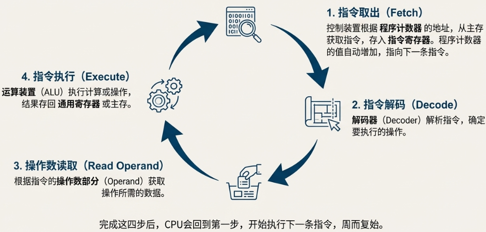
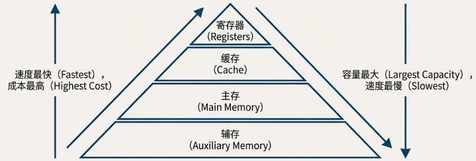

<h1 align="center">💻 计算机硬件核心：构造与性能衡量</h1>

  <b>基本情报技术者考试必修课 | 内容全量版</b> 
  <i>深入理解硬件“身体” | CPU 逻辑深度解析 | 存储金字塔体系</i>

---

## 🏗️ 1. 计算机硬件基础

### 1.1 硬件与软件：身体与灵魂
要理解计算机的工作原理，首先需区分：
*   **硬件 (ハードウェア)**：看得见、摸得着的物理部件（键盘、鼠标、显示器等）。
*   **软件 (ソフトウェア)**：指导硬件工作的无形指令（Excel、PowerPoint 等）。

### 1.2 计算机硬件五大装置

| 装置 | 日文名称 | 核心功能 |
| :--- | :---: | :--- |
| **控制装置** | 制御装置 | “指挥中心”，解读指令并指挥全身。 |
| **运算装置** | 演算装置 | “计算核心”，执行算术与逻辑运算。 |
| **存储装置** | 記憶装置 | “记忆库”，存放程序和数据（分长短期）。 |
| **输入装置** | 入力装置 | “感官”，如鼠标、键盘。 |
| **输出装置** | 出力装置 | “表达”，如显示器、打印机。 |

> [!IMPORTANT]
> **CPU (中央处理器)**：由控制装置和运算装置集成，是计算机的“大脑”。

### 1.3 冯·诺依曼结构 (Neumann Architecture)
1.  **程序存储方式** (プログラム内蔵方式)：程序和数据均以相同方式存储在主存中，CPU 按需读取。
2.  **逐次控制方式** (逐次制御方式)：CPU 从主存中一条接一条取出指令并按序执行。

---

## 🧠 2. 中央处理器 (CPU) 深度解析

### 2.1 内部构造与寄存器 (Register)
寄存器是 CPU 内部极高速的临时存储单元。

| 寄存器类型 | 日文名称 | 核心功能 |
| :--- | :--- | :--- |
| **程序计数器** | プログラムカウンタ | 存放**下一条**要执行指令的**地址**。 |
| **指令寄存器** | 命令レジスタ | 存放从内存中取出的**当前指令本身**。 |
| **通用寄存器** | 汎用レジスタ | 存放运算数据或中间结果。 |

> [!NOTE]
> 寄存器是计算机存储体系中速度最快的部件。

### 2.2 指令执行步骤

### 2.3 地址指定方式 (Addressing Modes)
决定指令的操作数部分如何定位数据位置。

| 方式名称 | 日文名称 | 原理说明 | 生活类比 |
| :--- | :--- | :--- | :--- |
| **立即寻址** | 即時アドレス | 操作数直接包含数据。 | 直接给你东西。 |
| **直接寻址** | 直接アドレス | 操作数是内存地址。 | 东西在 101 号房。 |
| **间接寻址** | 間接アドレス | 操作数是存放地址的地址。 | 看 101 的纸条去 202。 |
| **变址寻址** | インデックス指定 | 操作数地址 + 变址寄存器值。 | 基准房号 + 工号。 |
| **基址寻址** | ベースアドレス指定 | 操作数地址 + 基址寄存器值。 | 宿舍开头往后数第 N 个。 |
| **相对寻址** | 相対アドレス | 操作数地址 + 程序计数器值。 | 从你当前位置走 N 步。 |

### 2.4 CPU 性能关键指标
*   **时钟频率 (Hz)**：心跳速度。频率越高，单位时间执行动作越多。
*   **CPI**：单条指令所需的平均时钟周期。**越小越高效**。
*   **MIPS**：每秒百万次指令执行数。**综合性能衡量**。

### 2.5 高速化技术
*   **流水线处理 (Pipeline)**：工厂化作业，指令分阶并行处理。
*   **超级流水线**：阶段划分更细。
*   **超标量**：多条流水线并行。

#### 核心设计思想对比：

| 设计思想 | 全称 | 核心特点 |
| :--- | :--- | :--- |
| **CISC** | Complex Instruction Set Computer | 指令复杂强大，但长度不一，周期长。 |
| **RISC** | Reduced Instruction Set Computer | 指令简单固定，执行快，易于实现流水线。 |

---

## 💾 3. 存储装置：记忆金字塔

### 3.1 存储器层级：主存 vs 辅存

| 特性 | 主存储器 (主记忆装置) | 辅助存储器 (补助记忆装置) |
| :--- | :--- | :--- |
| **作用** | 临时存放 CPU 正在处理的数据。 | 长期保存大量数据和程序。 |
| **速度/容量** | 快 / 小 | 慢 / 大 |
| **代表** | 内存 (メモリ) | 硬盘 (HDD), 固态硬盘 (SSD) |

### 3.2 内存分类与特性 (RAM vs ROM)
*   **RAM (随机存取存储器)**：**内存条**。读写快，断电丢失。
*   **ROM (只读存储器)**：**如BIOS芯片**。主要只读，断电保留。

#### DRAM vs SRAM (必考对比)：

| 特性 | DRAM | SRAM |
| :--- | :--- | :--- |
| **数据保持** | 需定期**刷新 (Refresh)**。 | 通电即可保持，无需刷新。 |
| **速度** | 较慢。 | **非常快**。 |
| **集成度** | 高（结构简单）。 | 低（结构复杂）。 |
| **主要用途** | **主存储器**。 | **CPU 缓存 (Cache)**。 |
| **物理位置** | 内存条插槽。 | CPU 芯片内部。 |

> [!NOTE]
> **闪存 (Flash Memory)**：如 USB、SSD。兼具 ROM 不易失性和 RAM 可擦写性。

### 3.3 缓存 (Cache) 高速化
用于弥合 CPU 与主存之间的速度鸿沟。它利用了程序运行时访问数据倾向于集中在某个小范围内的**局部性原理**。

*   **命中率 (ヒット率)**: 指 CPU 需要的数据恰好在缓存中被找到的概率 (H)。命中率越高，总体访问速度越快。
*   **有效访问时间 (実行アクセス时间)** 计算公式：
    > **有效访问时间** $= (T_{cache} \times H) + (T_{mem} \times (1 - H))$
    > *(其中 $H$ 为命中率、$T_{cache}$ 为缓存访问时间、$T_{mem}$ 为主存访问时间)*

#### 写入策略：
1.  **写直通 (Write-through)**：同步写缓存与主存。数据一致性好，但速度慢。
2.  **写回 (Write-back)**：只写缓存，替换时再写主存。速度快，但管理复杂。

### 3.4 辅助存储与 RAID
*   **HDD vs SSD**：机械磁盘 vs 电子闪存。SSD 读写快、抗震、价高。
*   **HDD 物理结构**：磁道 (Track)、扇区 (Sector)、柱面 (Cylinder)。

*   **RAID 技术**：
    *   **RAID 0**：条带化，**极速**，无备份。
    *   **RAID 1**：镜像，**极稳**，空间减半。
    *   **RAID 5**：带校验，性能与安全的平衡点。

### 3.5 存储器速度与容量平衡
在整个计算机体系中，不同存储介质的速度、容量和价格各不相同。通常遵循以下规律：**距离 CPU 越近，速度越快，价格越高，容量越小。**

---

## 🔌 4. 输入输出 (I/O) 装置与接口

### 4.1 输入输出装置概览

*   **输入装置 (入力装置)**
    *   **定位设备 (ポインティングデバイス)**: 鼠标 (マウス), 触摸板 (タッチパネル)
    *   **读取设备 (読取装置)**: 扫描仪 (スキャナ), OCR (光学字符识别器)
*   **输出装置 (出力装置)**
    *   **显示设备**: 显示器 (ディスプレイ)
    *   **打印设备**: 打印机 (プリンタ)

### 4.2 显示器与打印机指标

*   **显示器关键概念**
    *   **分辨率 (解像度)**: 屏幕上横向和纵向的像素 (点) 的数量（如 1920x1080）。分辨率越高，图像越细腻。
    *   **VRAM (显存)**: 专门用来存储即将显示在屏幕上的图像内容的内存。
    

*   **打印机关键指标**
    *   **DPI (Dots Per Inch)**: 每英寸可以打印的点数，决定打印精度。
    *   **PPM (Pages Per Minute)**: 每分钟可以打印的页数，决定打印速度。

### 4.3 输入输出接口规范

**接口 (インターフェース)** 是连接主机与外部设备之间的规范或物理连接器。

| 接口类型 | 日文名称 | 传输方式 | 特点 |
| :--- | :--- | :--- | :--- |
| **串行接口** | シリアルインターフェース | 数据在一条线上逐位传输。 | 控制简单，抗干扰强，速度快，是**当前主流标准** (如 USB, HDMI)。 |
| **并行接口** | パラレルインターフェース | 多位数据在多条线路上同时传输。 | 曾用于打印机等，因控制复杂、易受干扰，现已很少使用。 |

> [!TIP]
> **现代接口两大神技**
> 1.  **热插拔 (ホットプラグ)**：设备可以在开机状态下随时连接或断开。
> 2.  **即插即用 (プラグアンドプレイ)**：设备连接后系统自动识别并完成配置。

#### **无线接口 (无线インターフェース)**
通过电波等方式传输数据而不涉及物理线缆。
*   **蓝牙 (Bluetooth)**: 使用 2.4GHz 频段的电波进行短距离通信。

---

