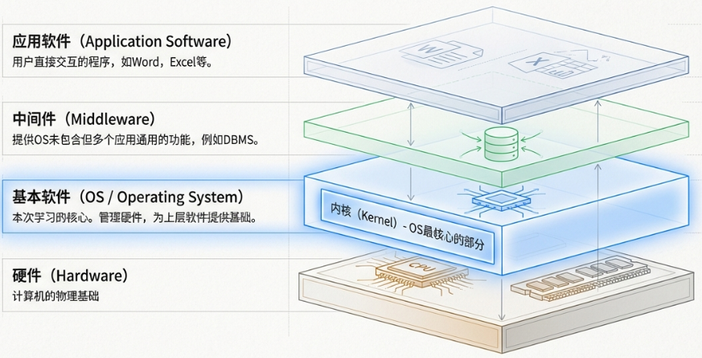
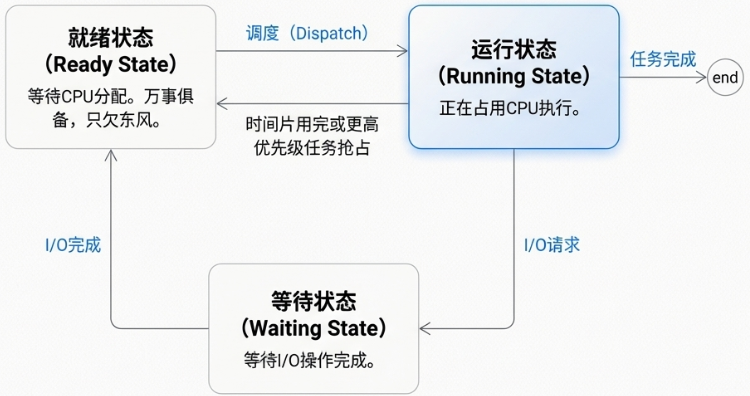
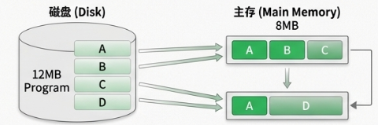
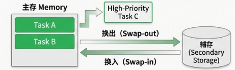
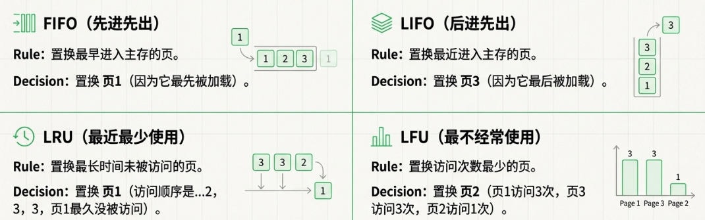

# 计算机软件核心：操作系统 (OS) 学习笔记

## 1. 软件基础：分层结构与 OS 核心

### 1.1 软件的层次结构
计算机软件是一个层次分明的系统，每一层都为上层提供服务：

*   **基本软件 (きほんソフトウェア/OS)**：最底层，负责管理物理硬件并提供核心原子服务。
*   **中间件 (ミドルウェア)**：位于 OS 与应用之间，提供通用功能（如 **DBMS** 数据库管理系统）。
*   **应用软件 (おうようソフトウェア)**：终端用户直接使用的程序（如 Office、浏览器）。

> [!TIP]
> **内核 (カーネル)** 是操作系统的核心，常驻内存，负责最基础的资源调度。

### 1.2 OS 的桥梁作用：接口 (Interface)
操作系统不仅管理硬件，还为用户和程序提供交互途径：

| 接口类型 | 全称 | 描述 |
| :--- | :--- | :--- |
| **GUI** | Graphical User Interface | 通过图标、按钮、窗口等可视化元素进行交互。 |
| **API** | Application Program Interface | 程序调用 OS 功能的规则集合。 |

### 1.3 OS 的三大管理职能
1.  **作业/任务管理 (ジョブ/タスク管理)**：合理分配 CPU 资源。
2.  **记忆管理 (記憶管理)**：确保多个程序安全、高效地共享主存。
3.  **文件管理 (ファイル管理)**：通过逻辑结构组织磁盘上的数据。

---

## 2. CPU 的大脑管家：作业与任务管理

### 2.1 作业 (Job) vs. 任务 (Task)
*   **作业 (ジョブ)**：**用户视角**。如“打印这份文档”。
*   **任务 (タスク)**：**OS 视角**。作业分解后的最小执行单元。

### 2.2 吞吐量优化：Spooling (スプーリング)
由于 CPU 速度极快而打印机等 I/O 设备极慢，OS 会将数据先存入中转站（磁盘）。
*   **优点**：CPU 无需等待 I/O 完成，显著提高系统**吞吐量 (スループット)**。

### 2.3 任务状态变迁
任务在生命周期中会在三种状态间循环切换：

1.  **就绪 (実行可能状態)**：万事俱备，只欠 CPU。
2.  **执行 (実行状態)**：正占有 CPU 进行运算。
3.  **等待 (待ち状态)**：正在等待 I/O 或其他事件，暂时挂起。

### 2.4 任务调度算法

**调度程序 (ディスパッチャ)** 负责根据特定算法在就绪队列中选择任务分配 CPU。

| 调度算法 | 日文名称 | 方式 | 核心特征 |
| :--- | :--- | :--- | :--- |
| **FCFS** | 先着順方式 | 非抢占式 | 按到达顺序执行，简单直观。 |
| **优先顺序** | 優先順位方式 | 抢占式 | 核心任务优先，优先级高者先运行。 |
| **时间片轮转** | ラウンドロビン | 抢占式 | 周期性切换，每个任务分配固定时长。 |

### 2.5 中断处理 (割り込み)

指 CPU 暂停当前正在执行的任务，转而去执行另一个紧急事件或优先级更高任务的过程。

#### 1. 内部中断 (内部割り込み)
由当前正在运行的程序**内部事件**引起，通常与指令执行直接相关。

*   **除以 0 (Zero Divide)**：程序执行了非法指令，如除数为 0 的运算时，硬件捕获该逻辑错误并触发中断。通常 OS 会终止该进程。
*   **页错误 (Page Fault / ページフォールト)**：在**虚拟内存**系统中，当程序访问的页面不在主存（RAM）时触发。OS 捕获此中断后，去辅助存储器将页调入内存。
*   **SVC 中断 (Supervisor Call)**：即**系统调用**。当用户程序需要 OS 提供服务（如读写文件、申请内存）时，通过执行专用指令主动请求切换到内核态。

#### 2. 外部中断 (外部割り込み)
由 CPU **外部的硬件设备**或计时器引起的异步事件。

*   **时钟中断 (Timer Interrupt)**：由系统计时器周期性触发。这是实现**时间片轮转 (RR)** 调度的基础。
*   **I/O 中断 (入出力割り込み)**：当磁盘读写完毕或网卡接收到数据时，硬件发出信号告知 CPU “任务已完成”。
*   **硬件故障 (Machine Check)**：检测到关键硬件异常（如内存校验错误、电源断电等）时触发的最高级中断。
*   **控制台终端中断**：操作员通过终端输入指令（如按下中断键）时产生的中断。

---

## 3. 实记忆管理 (物理层面 / Real Memory)

操作系统对物理内存条（RAM）进行的直接分配与回收。

### 3.1 内存分配方式
| 分配方式 | 描述 | 优点 | 缺点 |
| :--- | :--- | :--- | :--- |
| **固定分区方式** | 将内存预先划分为若干固定大小的区域。 | 管理逻辑简单，系统开销极小。 | 会产生**内部碎片**。 |
| **可变分区方式** | 根据程序大小动态分配刚好合适的空间。 | 内存利用率高，无内部碎片。 | 会产生散落的**外部碎片**。 |

### 3.2 碎片现象与解决
| 现象类型 | 核心描述 | 形象比喻 | 解决方案 |
| :--- | :--- | :--- | :--- |
| **内部碎片** | 分配区域内未被使用的多余空间。 | **包间浪费**：1人住4人间。 | 缩小分区粒度。 |
| **外部碎片** | 散落在各程序之间、无法利用的微小空隙。 | **位置尴尬**：路边零散车位。 | **内存紧缩** (Compaction) |

### 3.3 存储扩充策略
*   **覆盖 (Overlay)**：将一个大程序分割成多个相互独立的段（セグメント），在程序运行时，只将当前需要执行的段调入主存。当需要执行其他段时，再用新的段覆盖掉主存中不再需要的旧段。

*   **交换 (Swapping)**：将不运行的进程整体移至磁盘（**Swap-out**），需要时移回（**Swap-in**）。

---

## 4. 虚拟记忆管理 (逻辑层面 / Virtual Memory)

### 4.1 核心概念
*   **定义**：结合 **主存 (RAM)** 与 **辅存 (磁碟)**，营造“超大连续内存”假象的机制。
*   **优势**：**以小博大**（运行比物理内存大的程序）、**高效并发**、**安全隔离**。

### 4.2 实现技术：分页机制 (Paging)
*   **分页原理**：将虚拟地址空间和物理主存都划分为同样大小的固定块。虚拟空间的块称为**页(Page)**，物理空间的块称为**页框(Page Frame)**。
*   **页表 (Page Table)**：记录虚拟页与物理页框映射关系的“地图”。
*   **页错误 (Page Fault)**：因所需数据不在内存而触发的调页中断。
*   **Page-in (ページイン)**：将需要的页从辅存调入主存。
*   **Page-out (ページアウト)**：当内存满时，将暂时不用的页从主移至辅存。

### 4.3 页面调度与置换算法
*   **置换算法**：当内存满时决定替换哪个页面。
    *   **FIFO**：先进先出。
    *   **LRU (Least Recently Used)**：置换最近最少使用的页。
    *   **LFU (Least Frequently Used)**：置换使用频率最低的页。
    
*   **系统颠簸 (Thrashing)**：因频繁换页导致系统处理能力几乎归零的现象。

### 4.4 内存安全
*   **内存泄漏 (Memory Leak)**：程序未释放不再使用的内存导致资源耗尽。
*   **垃圾回收 (Garbage Collection)**：自动检测并回收不再使用的内存。

---

## 5. 文件管理系统

### 5.1 目录结构
采用**层次结构 (階層構造)**：
*   **根目录 (/)**：唯一起点。
*   **当前目录 (.)**：当前工作位置。
*   **父目录 (..)**：上一级。

### 5.2 路径表示
*   **绝对路径**：从根开始（如 `/home/user/doc.txt`）。
*   **相对路径**：从当前位置开始（如 `./images/pic.png`）。

---

## 6. 多媒体与图形学基础

### 6.1 压缩技术
*   **无损压缩 (可逆)**：100% 还原（如 GIF, PNG）。
*   **有损压缩 (不可逆)**：牺牲部分细节求高压缩率（如 **JPEG**, **MPEG**）。

### 5.2 计算机图形学 (CG) 术语
| 术语 | 描述 |
| :--- | :--- |
| **抗锯齿 (Anti-aliasing)** | 平滑边缘，消除锯齿感。 |
| **纹理映射 (Texture Mapping)** | 将纹理贴图覆盖到 3D 模型表面。 |
| **光线追踪 (Ray Tracing)** | 模拟光影逻辑，生成高质量真实图像。 |
| **变形 (Morphing)** | 一个形状平滑转化为另一个形状。 |

### 5.3 VR 与 AR
*   **VR (Virtual Reality)**：全虚拟世界，完全隔离现实。
*   **AR (Augmented Reality)**：在现实世界之上叠加载虚拟信息（如 Pokémon GO）。

---

> [!NOTE]
> **总结**：深刻理解 **任务调度** 和 **内存分页** 是 FE 考试中 OS 部分的得分关键。建议结合笔记中的中日文术语对照表进行记忆。
