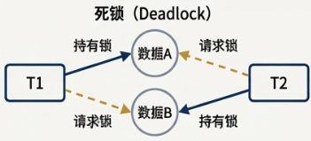
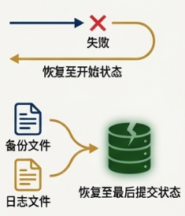
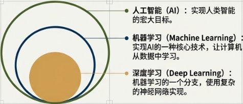

<h1 align="center">🗄️ 数据库核心概念学习笔记</h1>

  <b>针对“基本情报技术者考试”深度优化版</b> 
  <i>构建稳固的数据底座 | 掌握核心事务逻辑 | 玩转 SQL 语言</i>

---

## 🏗️ 1. 数据库基础：数据的大本营

### 1.1 什么是数据库和 DBMS？

我们可以将数据库想象成一个井井有条的图书馆书库，里面存放着海量的数据（图书）。但是，如果没有一套高效的管理系统，找书、放书、借书都会变得一团糟。这时，**数据库管理系统 (DBMS)** 管理员系统，负责数据的增、删、改、查等所有操作，确保一切都有条不紊。

| 术语 | 核心解释 |
| :--- | :--- |
| **数据库** (`データベース`) | 按照特定格式整理好的数据集合，可以理解为“数据的保管仓库”。 |
| **数据库管理系统** (`データベース管理システム`, `DBMS`) | 一种用于操作和控制数据库的软件。用户通过 DBMS 来与数据库进行交互。 |

> [!NOTE]
> **DBMS 本质上是一种中间件 (`ミドルウェア`)**。中间件的作用是提供操作系统（OS）本身不具备，但许多应用程序又普遍需要的功能。由于几乎所有应用都需要操作数据，DBMS就作为一种通用的数据管理中间件而存在。

### 1.2 关系型数据库：最主流的数据模型

数据库有多种数据存储形式，例如**层级型** (`階層型`) 和**网络型** (`ネットワーク型`)。但在基本情报技术者考试中，重点是使用表格来组织数据的**关系型数据库** (`RDB`)。

RDB 的基本构成元素非常简单，就像我们常用的电子表格一样：

| 构成元素 | 日文名称 | 通俗解释 |
| :--- | :--- | :--- |
| **表** | `テーブル` | 整个数据的集合，类似于一张 Excel 工作表。 |
| **行** | `レコード` / `組` / `タプル` | 表中的一条完整数据记录，代表一个实体。例如，“员工表”中的一行。 |
| **列** | `フィールド` / `属性` | 表中的一个字段，代表数据的一个属性。例如，“姓名”列。 |

> **注意**：`レコード`、`組`、`タプル` 在考试中均指“行”，可以互换使用。

---

## 📉 2. 数据库设计：构建稳固的地基

### 2.1 主键与外键：数据的身份证与关联器

#### **主键 (`主キー`)**
主键就像每个人的“身份证号”，它是表中用来唯一标识每一行数据的一列或多列的组合。一张表中只能有一个主键。
主键必须满足以下两个核心约束：
*   **唯一性约束** (`一意制約`): 主键的值在表中不能重复。
*   **非空约束** (`非null制約`): 主键的值不能为空 (`null`)。

#### **复合键 (`複合キー`)**
当单个列无法唯一确定一行数据时，需要将多个列组合起来共同作为主键。
*   **例子**: 将 `学年 + 班级 + 学号` 三个列组合起来，就可以唯一确定一名学生。

#### **外键 (`外部キー`)**
外键是建立不同表之间联系的桥梁。它是一张表中的一个列，其值引用了另一张表的主键。
*   **例子**: 员工表中的“部门编码”列是一个外键，它引用了部门表的主键。这样就能查询到每个员工所属的部门。

---

### 2.2 规范化：让数据井井有条

**核心目标**：减少数据冗余和避免数据矛盾，从而提高**数据独立性** (`データの独立性`)。

#### **🛠️ 规范化实战步骤**

**[ 初始状态：非规范化 ]**
为了记录交易，设计了许多重复列。

| 收据号 (`レシート番号`) | 日期 | 员工ID | 负责员工姓名 | 商品1编码 | 商品1名 | 单价 | 数量 | 商品2编码 | ... |
| :--- | :--- | :--- | :--- | :--- | :--- | :--- | :--- | :--- | :--- |
| R001 | 4月10日 | E01 | 山田花子 | P01 | 圆珠笔 | 100 | 2 | P02 | ... |

---

**1️⃣ 第一范式 (1NF：原子列，变多行)**
*   **任务**: 消除重复列，并将可计算的列删除。
*   **做法**: 将“横向”重复的商品列转为“纵向”的多行，确保字段原子性。

| 收据号 (PK) | 日期 | 员工ID | 员工姓名 | 商品编码 (PK) | 商品名 | 单价 | 数量 |
| :--- | :--- | :--- | :--- | :--- | :--- | :--- | :--- |
| **R001** | 4月10日 | E01 | 山田花子 | **P01** | 圆珠笔 | 100 | 2 |
| **R001** | 4月10日 | E01 | 山田花子 | **P02** | 笔记本 | 200 | 1 |

> **主键**: 由 `{收据号, 商品编码}` 组成的复合主键。

---

**2️⃣ 第二范式 (2NF：去局部，全靠键)**
*   **任务**: 消除**部分函数依赖** (`部分関数従属性`)。
*   **核心逻辑**: 每一列必须依赖于**整个**复合主键。
*   **分析本例**: “商品名”只看“商品编码”就够了，跟“收据号”无关。

**【销售表】** (依赖收据号)
| 收据号 (PK) | 日期 | 员工ID | 员工姓名 |
| :--- | :--- | :--- | :--- |
| R001 | 4月10日 | E01 | 山田花子 |

**【商品表】** (依赖商品编码)
| 商品编码 (PK) | 商品名 | 单价 |
| :--- | :--- | :--- |
| P01 | 圆珠笔 | 100 |
| P02 | 笔记本 | 200 |

**【销售明细表】** (依赖复合主键)
| 收据号 (PK) | 商品编码 (PK) | 数量 |
| :--- | :--- | :--- |
| R001 | P01 | 2 |
| R001 | P02 | 1 |

> [!IMPORTANT]
> **2NF 并不是要消除复合主键**。例如【销售明细表】中的“数量”必须同时由收据和商品决定，因此保留复合主键。

---

**3️⃣ 第三范式 (3NF：去传递，没中间)**
*   **任务**: 消除**传递函数依赖** (`推移的関数従属性`)。
*   **核心逻辑**: 消除“间接关系”。主键 $A \to$ 非主键 $B \to$ 非主键 $C$。
*   **分析本例**: 在【销售表】中，收据号 $\to$ 员工ID $\to$ 员工姓名（这是嵌套 ID，即平民 ID 领了个属性）。

**【最终销售记录表】**
| 收据号 (PK) | 日期 | 员工ID |
| :--- | :--- | :--- |
| R001 | 4月10日 | E01 |

**【最终员工表】**
| 员工ID (PK) | 员工姓名 |
| :--- | :--- |
| E01 | 山田花子 |

> **结果**: 最终得到 4 张逻辑清晰、无冗余的表。

---

#### **🔍 核心思想总结**

> [!TIP]
> **如何快速找依赖项？（解题绝招）**
> 1.  **找 ID**：盯住那些编号列（收据号、商品号等）。
> 2.  **找主子**：问每个非 ID 列：“我只需要哪个 ID 就能确定？”
>     *   只依赖**一部分** ID $\rightarrow$ **2NF** 拆分。
>     *   依赖一个**平民 ID** $\rightarrow$ **3NF** 拆分。
> 3.  **数表数**：$N$ 个主键 ID 成员，通常意味着 **$N+1$** 张表。

> **规范化三步走口诀：**
> *   **1NF：原子列，变多行**（重复属性变多行）
> *   **2NF：去局部，全靠键**（消除对主键“成员”的局部依赖）
>     *   盯住 ID 编号列 
>     *   看非 ID 列依附于哪个编号 
>     *   2个主编号 $= 2+1$ 张表
> *   **3NF：去传递，没中间**（消除非主键之间的传递依赖）
>     *   **盯住平民 ID**（非主键 ID）
>     *   看是否有非主键列依附于另一个非主键 ID
>     *   只要 ID 嵌套 ID，就得拆成两张表

---

### 2.3 三层模式结构：多重视角看数据

为了实现**数据独立性** (`データの独立性`)，数据库采用**三层模式结构** (`三層スキーマ構造`)。

*   **外部模式 (`外部スキーマ`)**: 用户或应用程序看到的视图。（比喻：ATM 操作界面）
*   **概念模式 (`概念スキーマ`)**: 数据库的全局逻辑结构。（比喻：账户设计图：账号、户名、余额）
*   **内部模式 (`内部スキーマ`)**: 物理存储方式。（比喻：数据在硬盘上的实际存储文件）

> [!NOTE]
> **什么是“变化”？**
> *   **物理独立性**: 物理存储变化（如从 HDD 换成 SSD）不影响逻辑层。
> *   **逻辑独立性**: 逻辑结构变化（如给表增加新列、修改字段名）不影响外部应用。

---

## 🔒 3. 数据库事务处理：安全可靠

### 3.1 事务与 ACID 特性

**事务** (`トランザクション/Transaction`) 是一个不可分割的操作单元：**要么全部成功，要么全部失败。**

为了保证可靠性，必须遵守 **ACID** 四大特性：

| 特性 | 英文原文 | 核心解释 |
| :--- | :--- | :--- |
| **A - 原子性** (`原子性`) | **A**tomicity | “不可分割”。杜绝操作只完成一半（如转账只扣不收）。 |
| **C - 一致性** (`一貫性`) | **C**onsistency | 事务执行前后，数据库的内容保持逻辑一致，无矛盾。 |
| **I - 隔离性** (`隔離性`) | **I**solation | 多个事务并发执行时，互不干扰，像在独立环境运行。 |
| **D - 持久性** (`耐久性`) | **D**urability | 事务提交后结果永久保存，即使发生故障也不会丢失。 |

### 3.2 并发控制与锁

当多个事务同时访问同一数据时，需要使用**加锁** (`ロック`) 机制。

| 锁机制 | 描述 |
| :--- | :--- |
| **共享锁** (`共有ロック`) | 也称“读锁”。其他事务**可以读取但不能修改**。多人可同时持有。 |
| **排他锁** (`占有ロック`) | 也称“写锁”。其他事务**既不能读取也不能修改**。仅限一人持有。 |

*   **死锁 (`デッドロック`)**: 两个事务互相持有对方需要的锁，陷入永久等待。
    

*   **锁的粒度**:
    *   **大粒度** (如表锁)：锁冲突概率高，并发性差，但管理简单。
    *   **小粒度** (如行锁)：锁冲突概率低，并发性好，但系统开销大。

---

## ⏪ 4. 数据库恢复机制：数据的复活术

### 4.1 核心组件：日志与备份

*   **备份文件**: 定期对整个数据库进行的完整物理复制。
*   **日志文件 (`ジャーナルファイル`)**: 详细记录所有更新操作。
    *   **更新前日志**: 记录修改前的状态。
    *   **更新后日志**: 记录修改后的状态。

### 4.2 两种核心恢复操作

| 操作类型 | 场景 | 工具 | 目的 |
| :--- | :--- | :--- | :--- |
| **回滚 (Rollback)** | 事务执行中出错 | 更新前日志 | 撤销操作，恢复到事务开始前。 |
| **前滚 (Rollforward)** | 系统崩溃/硬盘损坏 | 备份 + 更新后日志 | 从备份点开始重做，恢复到故障前。 |

---

## ⌨️ 5. SQL 语言入门：与数据库对话

*   **DDL (数据定义语言)**: `CREATE` (建表), `DROP` (删表), `ALTER` (改结构)。
*   **DML (数据操作语言)**: `SELECT` (查), `INSERT` (增), `UPDATE` (改), `DELETE` (删)。

<h4 align="center">SELECT 语句详解</h4>

| 子句 | 作用 |
| :--- | :--- |
| `SELECT ... FROM ...` | 指定列和表。 |
| `WHERE` | **分组前** 筛选行。 |
| `GROUP BY` | 按列分组计算。 |
| `HAVING` | **分组后** 筛选结果。 |
| `ORDER BY` | 排序（`ASC` 升序，`DESC` 降序）。 |
| **聚合函数** | `SUM`, `AVG`, `COUNT`, `MAX`, `MIN` 等。 |

---

## 🧠 6. 现代数据技术概览

### 6.1 AI、ML 与 DL 的关系

*   **层级关系**: 人工智能 (AI) > 机器学习 (ML) > 深度学习 (DL)。
*   **深度辨析**: 监督/无监督/强化学习是机器学习的“分类”（描述怎么学）；而深度学习是一种“特有的先进技术”。

### 6.2 机器学习的三种方法

| 学习方式 | 核心思想 | 例子 |
| :--- | :--- | :--- |
| **监督学习** | 提供带标签的“正确答案”。 | 房价预测、识别垃圾邮件。 |
| **无监督学习** | 不提供答案，让机器找模式。 | 用户聚类、关联规则发现。 |
| **强化学习** | 通过“奖励”和“惩罚”不断试错。 | AlphaGo、自动驾驶。 |

---