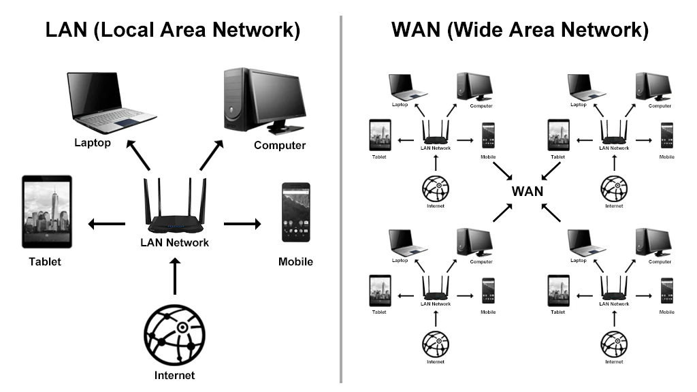
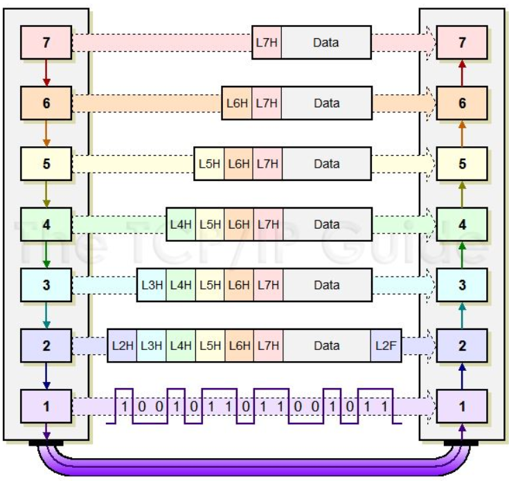
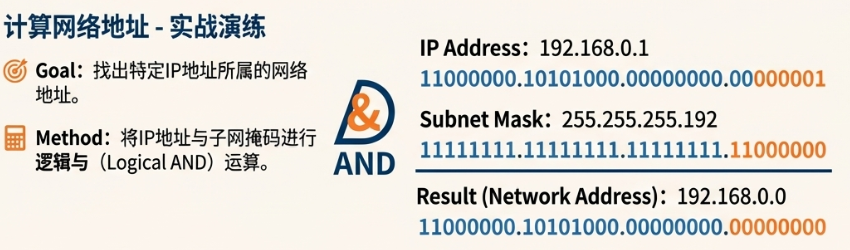
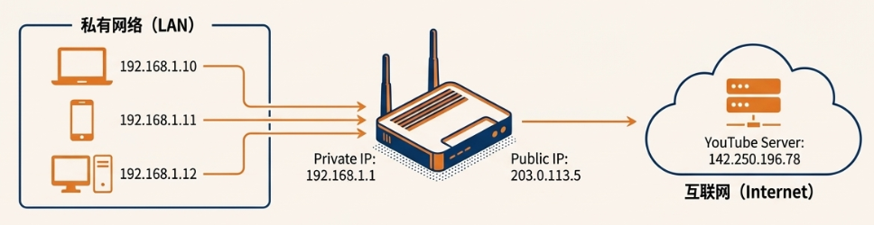

<h1 align="center">🌐 网络基础与 OSI 七层模型</h1>
<p align="center">
  <b>针对"基本情报技术者考试"深度优化版</b><br>
  <i>掌握网络通信核心 | 理解协议栈结构 | 精通 IP 地址管理</i>
</p>

---

## 🔌 1. 网络通信基础

### 1.1 什么是网络？

**网络** (`ネットワーク`) 是由 **通信设备** (`通信機器`) 和 **通信线路** (`通信回線`) 构成的，其核心作用是连接计算机等各种设备。

---

### 1.2 数据包传输机制

#### 分包传输的必要性

直接传输大文件会长时间占用通信线路，造成网络拥堵。为了实现高效传输，需要将大的数据块分解成被称为 **数据包** (`パケット`) 的小单元进行传输。

</div>

<p align="center"></p>

#### 数据包的组成

每个数据包都有一个标签，也就是 **报头** (`ヘッダ`)，报头里记录着 **目标地址** (`宛先情報`) 等控制信息。

<div align="center">

**[ 数据分包传输核心优势 ]**

| 优势 | 说明 |
| :--- | :--- |
| **避免拥堵** | 小的数据包不会长时间占用通信线路，保证网络流畅。 |
| **高效重传** | 数据包出错或丢失时，只需重新发送该数据包，无需重传整个文件。 |

</div>

---

### 1.3 协议 (プロトコル)

**协议** (`プロトコル`) 是数据发送方和接收方为了能够成功通信而必须共同遵守的一套规则。如果通信双方对数据传输的规则理解不一致，通信将无法成功完成。

---

### 1.4 网络的分类：LAN 与 WAN

#### LAN (局域网)

**LAN** (`Local Area Network`, `ローカルエリアネットワーク`) 是 **局域网** (`構内ネットワーク`) 的简称，指在有限的地理范围内（如办公室、学校、家庭）连接多台计算机和设备的网络。

#### WAN (广域网)

**WAN** (`Wide Area Network`, `ワイドエリアネットワーク`) 是 **广域网** 的简称，指跨越较大地理范围（如城市、国家、甚至全球）连接多个 LAN 的网络。

<p align="center"></p>

<div align="center">

</div>

---

## 🏗️ 2. OSI 基本参照模型

### 2.1 OSI 模型的诞生背景

在 OSI 模型诞生之前，不同公司的设备使用各自独立的协议，导致只有同一家公司的产品才能互相连接组成网络。

为了解决这种互不相通的困境，国际标准化组织提出了 **OSI 基本参照模型** (`OSI基本参照モデル`)。它的核心目的是实现网络协议的 **标准化** (`標準化`)，让任何公司的设备都能遵循同一套框架进行通信。

OSI 模型将复杂的网络通信功能划分为 **七个独立的层次** (`階層`)，每一层都只负责自己特定的任务，并与上下层进行交互。

---

### 2.2 OSI 七层模型详解

为了更好地理解 OSI 七层模型，下表同时展示了每一层的功能、相关设备，以及发送邮件时的实际操作。

<div align="center">

| 层次 | 名称 | 核心功能 | 相关设备 | 发送邮件实例 |
| :---: | :--- | :--- | :--- | :--- |
| **第 7 层** | **应用层**<br>(`アプリケーション層`) | 提供用户与网络的接口 | - | 在邮件客户端编写邮件，点击“发送”。使用 SMTP 协议准备邮件数据。 |
| **第 6 层** | **表示层**<br>(`プレゼンテーション層`) | 数据格式转换、加密解密 | - | 将邮件内容转换为 UTF-8 编码，进行加密和压缩处理。 |
| **第 5 层** | **会话层**<br>(`セッション層`) | 管理通信会话 | - | 建立与邮件服务器的会话连接，管理整个通信过程。 |
| **第 4 层** | **传输层**<br>(`トランスポート層`) | 端到端可靠传输 | 网关 (`ゲートウェイ`) | 使用 TCP 协议将邮件分割成数据段，添加端口号（源端口 12345，目标端口 25）。 |
| **第 3 层** | **网络层**<br>(`ネットワーク層`) | 路径选择与路由 | 路由器 (`ルータ`) | 添加 IP 报头（源 IP：192.168.1.10，目标 IP：203.0.113.5），选择最佳路径。 |
| **第 2 层** | **数据链路层**<br>(`データリンク層`) | 同一网络内节点间传输 | 交换机 (`スイッチングハブ`) | 添加 MAC 报头（源 MAC 和目标 MAC 地址），进行错误检测。 |
| **第 1 层** | **物理层**<br>(`物理層`) | 物理信号传输 | 网卡 (`NIC`), 集线器 (`リピータハブ`) | 将数据帧转换为电信号或光信号，通过网线传输。 |

</div>

> [!NOTE]
> **IP 地址与端口的区别**
>
> * **IP 地址** (`IPアドレス`)：用于识别网络中的具体设备（第 3 层 - 网络层）。
> * **端口号** (`ポート番号`)：用于识别设备上的具体应用程序（第 4 层 - 传输层）。
>
> **举例说明**：
>
> 假设你要给朋友发送邮件，朋友的电脑 IP 地址是 `192.168.1.100`。
>
> * **IP 地址 `192.168.1.100`**：就像公寓楼的地址“XX街道123号”，告诉邮递员要去哪栋楼。
> * **端口号 `25`（SMTP 邮件服务）**：就像公寓楼里的房间号“301室”，告诉邮递员要送到哪个房间。
>
> 同一台电脑（同一个 IP 地址）上可以运行多个应用程序，每个应用程序使用不同的端口号：
>
> <div align="center">
>
> | IP 地址 | 端口号 | 应用程序 |
> | :--- | :---: | :--- |
> | `192.168.1.100` | `80` | 网页服务器 (HTTP) |
> | `192.168.1.100` | `25` | 邮件服务器 (SMTP) |
> | `192.168.1.100` | `21` | 文件传输服务器 (FTP) |
> | `192.168.1.100` | `443` | 安全网页服务器 (HTTPS) |
>
> </div>
>
> 这样，数据包不仅知道要发送到哪台电脑（IP 地址），还知道要交给这台电脑上的哪个应用程序（端口号）。
>
> **那么 MAC 地址是什么？**
>
> **MAC 地址** (`MACアドレス`, Media Access Control Address) 是 第 2 层（数据链路层）使用的硬件地址，用于在 **同一局域网内**识别具体设备。
>
> * **格式**：`AA:BB:CC:DD:EE:FF`（6 组十六进制数）
> * **特点**：每个网络设备出厂时就有唯一的 MAC 地址，类似于“身份证号”，固定不变。
> * **作用范围**：只在同一局域网内有效，就像公寓楼内部的门牌号。
>
> **三种地址的关系**：
>
> 1. **MAC 地址**：在同一局域网内找到具体设备。
> 2. **IP 地址**：跨越不同网络找到目标设备（楼号）。
> 3. **端口号**：在设备上找到具体应用程序（房间号）。

---

#### 各层详细说明

#### 第 7 层：应用层 (アプリケーション層)

* **核心功能**：提供用户与网络的接口。
* **具体任务**：
  * 定义应用程序特有的通信规则，例如网页浏览 (`HTTP`)、文件传输 (`FTP`)、电子邮件 (`SMTP`) 等。
* **实例**：你在 Outlook 中写好邮件，点击发送。邮件客户端使用 SMTP 协议准备发送。

---

#### 第 6 层：表示层 (プレゼンテーション層)

* **核心功能**：确保计算机之间能读懂对方的数据格式。
* **具体任务**：
  * **文字编码** (`文字コード`) 转换，确保不同字符集能被正确识别。
  * 数据的 **压缩** (`圧縮`) 与 **解压** (`解凍`)，提高传输效率。
  * 数据的 **加密** (`暗号化`) 与解密，保障通信安全。
* **实例**：邮件内容被编码为 UTF-8 格式，如果设置了加密，则进行加密处理。

---

#### 第 5 层：会话层 (セッション層)

* **核心功能**：负责建立、管理和终止通信会话。
* **具体任务**：
  * 管理通信连接的开始与结束。
  * 处理通信中断后的恢复等同步问题。
* **实例**：建立与邮件服务器的会话，管理整个通信过程。

---

#### 第 4 层：传输层 (トランスポート層)

* **核心功能**：确保数据可靠、准确地从发送端传输到接收端。
* **具体任务**：
  * 提供可靠的 **端到端** (`エンドツーエンド`) 通信。
  * 进行数据传输中的错误检测和恢复。
  * 根据应用需求，决定通信是优先考虑 **可靠性** (`信頼性`) 还是速度。
* **相关设备**：**网关** (`ゲートウェイ`) 在此层及以上各层工作，负责转换不同协议的网络。
* **实例**：TCP 协议将邮件分成多个数据段，每个数据段添加 TCP 报头（包含源端口 12345 和目标端口 25）。

---

#### 第 3 层：网络层 (ネットワーク層)

* **核心功能**：负责规划数据跨越多个网络的最佳路径。
* **具体任务**：
  * 定义网络间的 **路径选择** (`経路選択`) 和数据中继。
  * 使用 **IP 地址** (`IPアドレス`) 来识别网络中的设备，实现从源头到最终目的地的数据传输。
* **相关设备**：**路由器** (`ルータ`)，也称为 **三层交换机** (`レイヤ3スイッチ`)。
* **实例**：为每个数据段添加 IP 报头（源 IP：192.168.1.10，目标 IP：203.0.113.5），路由器根据 IP 地址选择路径。

---

#### 第 2 层：数据链路层 (データリンク層)

* **核心功能**：负责在同一个网络内的节点间可靠地传输数据。
* **具体任务**：
  * 管理 **节点** (`ノード`，即网络中的设备) 之间的直接通信。
  * 使用 **MAC 地址** (`MACアドレス`) 来识别同一网络内的具体设备。
  * 进行错误检测，例如通过 `CSMA/CD` 等方式避免数据 **冲突** (`衝突`, 或 `コリジョン`)。
* **相关设备**：**网桥** (`ブリッジ`)、**交换机** (`スイッチングハブ`)，也称为 **二层交换机** (`レイヤ2スイッチ`)。
* **实例**：添加 MAC 报头（源 MAC 和下一跳设备的 MAC 地址），封装成数据帧。

---

#### 第 1 层：物理层 (物理層)

* **核心功能**：负责将 0 和 1 的数字信号转换为物理信号（如电信号、光信号）在线缆上传输。
* **相关设备**：**网卡** (`NIC`)、**中继器** (`リピータ`)、**集线器** (`リピータハブ`)。
* **实例**：将数据帧转换为电信号，通过网线传输。

> [!IMPORTANT]
> **关键理解**：每一层只与对等层通信。发送端的应用层与接收端的应用层通信，传输层与传输层通信，以此类推。每一层都只关心自己的职责，不需要了解其他层的细节。

---

### 2.3 封装与解封装

#### 发送过程（封装）

当发送数据时，数据会从第 7 层开始，逐层向下传递。每一层都会在数据的基础上添加自己的 **报头** (`ヘッダ`)。

<div align="center">

| 层次 | 操作 | 数据单元名称 |
| :--- | :--- | :--- |
| **第 7/6/5 层** | 原始数据被处理，准备进行传输 | 数据 (`Data`) |
| **第 4 层** | 加上 TCP/UDP 报头，包含端口号等信息 | 数据段 (`Segment`) |
| **第 3 层** | 加上 IP 报头，包含源和目标 IP 地址 | 数据包 (`Packet`) |
| **第 2 层** | 加上 MAC 报头，包含源和目标 MAC 地址 | 数据帧 (`Frame`) |
| **第 1 层** | 转换成物理信号（0 和 1 的比特流） | 比特流 (`Bit Stream`) |

</div>

---

#### 接收过程（解封装）

当接收数据时，过程正好相反，数据从第 1 层开始，逐层向上传递。每一层都会处理对应层的报头：

<p align="center"></p>

---

## 🌍 3. TCP/IP 模型：互联网的实际标准

### 3.1 从 OSI 到 TCP/IP

**TCP/IP 模型**可以看作是 OSI 模型的简化和实践版本，是当前 **互联网** (`インターネット`) 世界事实上的标准。它在 OSI 模型普及之前就已经被广泛应用，并最终成为主流。

<div align="center">

| TCP/IP 模型 | 对应的 OSI 模型 |
| :--- | :--- |
| **应用层** | 应用层、表示层、会话层 (7-5 层) |
| **传输层** | 传输层 (第 4 层) |
| **互联网层** | 网络层 (第 3 层) |
| **网络接口层** | 数据链路层、物理层 (2-1 层) |

</div>

<p align="center"></p>

---

### 3.2 核心协议介绍

#### IP (互联网协议)

**IP 协议** (`インターネットプロトコル`) 是互联网层的核心。它负责为网络中的每一台设备分配一个唯一的 IP 地址，并根据这个地址进行数据包的寻址和路由。

---

#### TCP vs. UDP

在传输层，有两个最重要的协议：**TCP** 和 **UDP**。它们的选择取决于应用对可靠性和速度的不同要求。

<div align="center">

| 特性 | TCP (Transmission Control Protocol) | UDP (User Datagram Protocol) |
| :--- | :--- | :--- |
| **核心特点** | 面向连接，可靠性高 | 无连接，速度快 |
| **工作方式** | 通信前需建立连接（三次握手），进行可靠性确认，确保数据按序、无差错地送达。 | 不建立连接，直接发送数据，不保证送达，但延迟低。 |
| **适用场景** | 电子邮件、文件传输等要求数据完整、准确无误的场合。 | 视频直播、在线游戏等对实时性要求极高，可以容忍少量数据丢失的场合。 |

</div>

---

## 🏠 4. IP 地址与子网管理

### 4.1 IP 地址的结构

#### 基本构成

**IPv4 地址**是一个 **32 位**的二进制数。为了方便记忆和读写，它通常被分为 4 个 8 位的块，并用十进制表示（例如 `192.168.0.1`）。

#### 实践：查看你的 IP 地址

> [!TIP]
> **我是谁？使用 `ipconfig` 查看本机网络信息**
>
> 在 Windows 系统中，可以使用 `ipconfig` 命令查看本机的 IP 地址信息：
>
> 1. 按 `Win + R` 打开运行窗口，输入 `cmd` 打开命令提示符。
> 2. 输入命令：`ipconfig`
>
> 你会看到类似以下的输出：
>
> ```
> 以太网适配器 以太网:
> 
>    连接特定的 DNS 后缀 . . . . . . . :
>    IPv4 地址 . . . . . . . . . . . . : 192.168.1.100
>    子网掩码  . . . . . . . . . . . . : 255.255.255.0
>    默认网关. . . . . . . . . . . . . : 192.168.1.1
> ```
>
> **信息解读**：
>
> * **IPv4 地址** `192.168.1.100`：你的电脑在局域网中的 IP 地址。
> * **子网掩码** `255.255.255.0`：用于区分网络部分和主机部分（下一节会详细讲解）。
> * **默认网关** `192.168.1.1`：你的路由器的 IP 地址，负责将数据转发到其他网络。
>
> 如果想查看更详细的信息（包括 MAC 地址），可以使用：`ipconfig /all`

#### 两部分组成

一个 IP 地址由两部分构成：

* **网络部分** (`ネットワーク部`)：标识设备所在的具体网络。
* **主机部分** (`ホスト部`)：标识该网络中的具体设备。

**具体例子**：以 `192.168.1.100` 为例

<div align="center">

| IP 地址（十进制） | IP 地址（二进制） |
| :--- | :--- |
| `192.168.1.100` | `11000000.10101000.00000001.01100100` |
| **网络部分** | `11000000.10101000.00000001` |
| **主机部分** | `01100100` |

</div>

**解读**：

* **网络部分** `192.168.1`：表示这台设备在 `192.168.1.0` 这个网络中。
* **主机部分** `100`：表示这是该网络中的第 100 号设备。
* 同一网络中的其他设备（如 `192.168.1.50`、`192.168.1.200`）都共享相同的网络部分 `192.168.1`，但有不同的主机部分。

> [!NOTE]
> 由于互联网的飞速发展，由 32 位构成的 IPv4 地址数量逐渐耗尽。为此，由 **128 位**构成的下一代 IP 地址——**IPv6** 应运而生。然而，通过 NAT/NAPT 等地址管理技术，IPv4 至今仍在广泛使用，并且是考试中考察的绝对重点。因此，除非特别说明，我们通常所说的 IP 地址指的就是 **IPv4**。

---

### 4.2 子网掩码

#### 核心功能

**子网掩码** (`サブネットマスク`) 是一个与 IP 地址同样长度（32 位）的数值，用来明确区分 IP 地址中哪部分是网络部分，哪部分是主机部分。

* 子网掩码中值为 **1** 的部分对应 IP 地址的 **网络部分**。
* 子网掩码中值为 **0** 的部分对应 IP 地址的 **主机部分**。

#### CIDR 表示法

为了更简洁地表示子网掩码，我们常用 **CIDR** (`サイダー`) 表示法。

> **示例**：`192.168.0.1/26`，斜杠后的数字 **26** 代表子网掩码中连续 1 的个数，即网络部分的长度为 26 位。

**具体例子**：以 `192.168.1.100/24` 为例

* **IP 地址**：`192.168.1.100`
* **子网掩码**：`/24` 表示前 24 位是网络部分，即 `255.255.255.0`
  * 二进制：`11111111.11111111.11111111.00000000`（前 24 个 1，后 8 个 0）
* **网络部分**：前 24 位，即 `192.168.1`
* **主机部分**：后 8 位，即 `100`
* **可用主机数**：$2^8 - 2 = 254$ 个（减去网络地址和广播地址）

<div align="center">

| CIDR 表示 | 子网掩码（十进制） | 网络位 | 主机位 | 可用主机数 |
| :---: | :--- | :---: | :---: | :---: |
| `/24` | `255.255.255.0` | 24 | 8 | 254 |
| `/25` | `255.255.255.128` | 25 | 7 | 126 |
| `/26` | `255.255.255.192` | 26 | 6 | 62 |
| `/27` | `255.255.255.224` | 27 | 5 | 30 |
| `/28` | `255.255.255.240` | 28 | 4 | 14 |

</div>

<p align="center"></p>

---

### 4.3 特殊地址

<div align="center">

| 地址类型 | 特征 | 说明 |
| :--- | :--- | :--- |
| **网络地址** | 主机部分全为 0 | 代表整个网络本身，不能分配给具体设备。可通过 IP 地址与子网掩码进行 **逻辑与** (`論理積`) 运算得到。 |
| **广播地址** | 主机部分全为 1 | 向该网络内的所有设备发送数据，不能分配给具体设备。 |

</div>

**具体例子**：对于网络 `192.168.1.0/24`（子网掩码 `255.255.255.0`）

* **广播地址**：`192.168.1.255`（主机部分全为 1）
  * 作用：向 `192.168.1.255` 发送数据，该网络中的所有设备（`192.168.1.1` 到 `192.168.1.254`）都会收到。

* **可用 IP 地址范围**：
  * 网络地址：`192.168.1.0`（不可用）
  * 可用主机地址：`192.168.1.1` ~ `192.168.1.254`（共 254 个）
  * 广播地址：`192.168.1.255`（不可用）

> [!CAUTION]
> "网络地址"这个术语有时也用来指代 IP 地址中的网络部分本身。

---

### 4.4 公网与私网 IP 地址

<div align="center">

| 地址类型 | 日文名称 | 特点 |
| :--- | :--- | :--- |
| **公网 IP 地址** | `グローバルIPアドレス` | 在整个互联网上唯一且可直接访问的地址，如运营商。 |
| **私网 IP 地址** | `プライベートIPアドレス` | 在局域网 (LAN) 内部使用的地址，可以重复，例如A和B家里的private IP 都是 192.168.1.1。 |

</div>

<p align="center"></p>

---

#### 地址转换技术

由于私有 IP 地址不能直接访问互联网，需要地址转换技术：

* **NAT** (`ナット`)：**网络地址转换** (`ネットワークアドレストランスレーション`) 技术，将一个私有 IP 地址与一个全局 IP 地址进行 **一对一**的转换。
* **NAPT** (`ナプト`)：**网络地址端口转换** (`ネットワークアドレスポートトランスレーション`)，也常被称为 **IP 伪装** (`IPマスカレード`)。它通过使用不同的端口号，实现将 **多个私有 IP 地址**映射到 **一个全局 IP 地址**上。这是目前家庭和企业路由器中最常用的技术。

---

### 4.5 域名系统 (DNS)

#### 问题与解决方案

纯数字 IP 地址（如 `31.13.82.1`）难以记忆。为此，我们引入了 **域名** (`ドメイン`)，例如 `facebook.com`。

**DNS** (`ドメインネームシステム`) 服务器负责将域名翻译成对应的 IP 地址，使计算机能够找到正确的服务器。

<p align="center"></p>

---

## 📚 备考核心词汇表 (Glossary)

<div align="center">

| 中文词汇 | 假名标注 | 英文参考 |
| :--- | :--- | :--- |
| **协议** | プロトコル | Protocol |
| **局域网** | ローカルエリアネットワーク | Local Area Network (LAN) |
| **广域网** | ワイドエリアネットワーク | Wide Area Network (WAN) |
| **OSI参考模型** | OSI（オーエスアイ）参照（さんしょう）モデル | OSI Reference Model |
| **IP地址** | IP（アイピー）アドレス | IP Address |
| **子网掩码** | サブネットマスク | Subnet Mask |
| **MAC地址** | MAC（マック）アドレス | MAC Address |
| **路由器** | ルータ | Router |
| **交换机** | スイッチングハブ | Switching Hub (Switch) |
| **网关** | ゲートウェイ | Gateway |
| **域名系统** | DNS（ディーエヌエス） | Domain Name System |
| **地址转换** | NAT（ナット）/ NAPT（ナプト） | Network Address Translation |

</div>

---

<p align="center">
  <em>"信号织就时空的经纬，连接构筑世界的共鸣。"</em><br>
  <strong>Signals weave the warp and weft of space-time; connection builds the resonance of the world.</strong>
</p>
