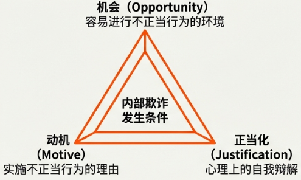
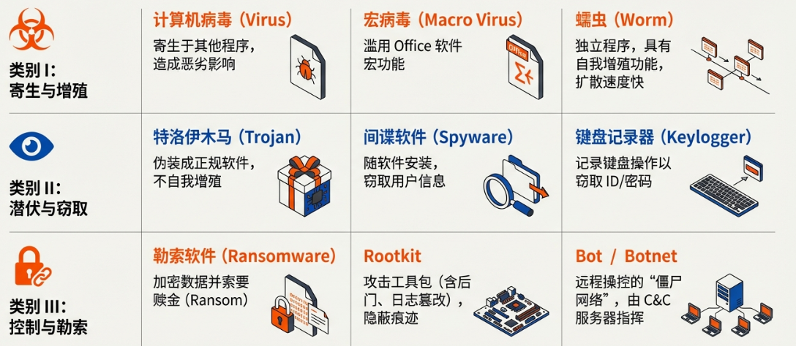
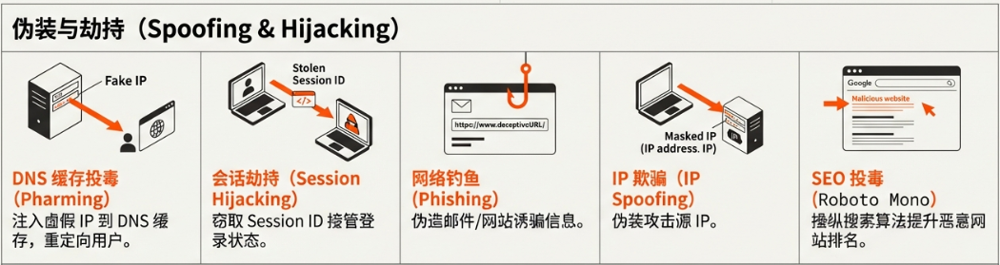
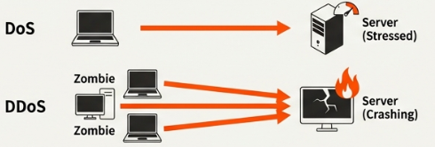
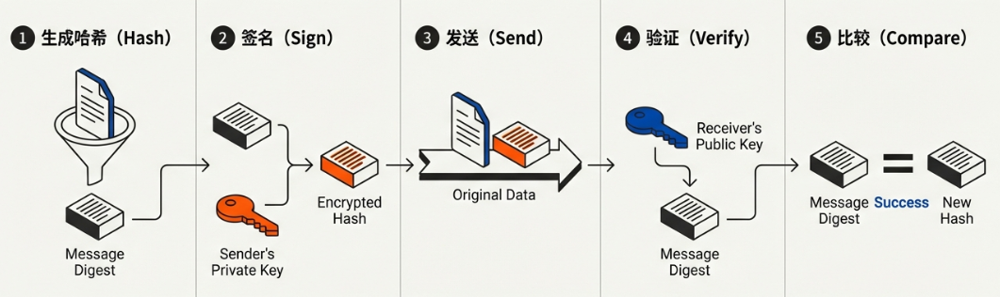
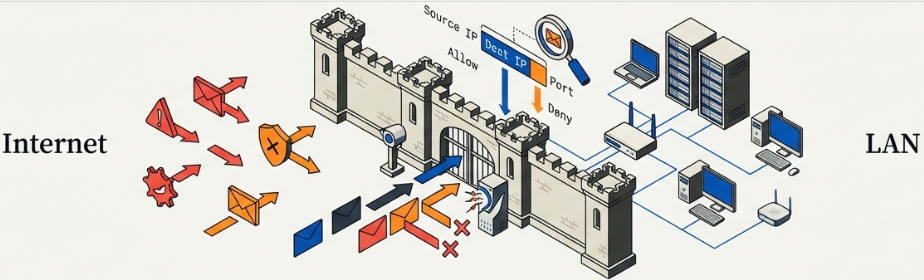

<h1 align="center">🔐 信息安全基础知识备考笔记</h1>

  <strong>Information Security Fundamentals</strong> 
  <i>基本情報技術者試験 - セキュリティ分野</i>

---

## 📚 1. 信息安全的基本概念

随着互联网的发展，我们的生活变得愈发便利，但同时也面临着日益增多的网络攻击和信息泄露风险。为了有效防范这些风险，理解信息安全的核心理念至关重要。信息安全的风险主要由两大核心要素构成：**脆弱性**和**威胁**。

### 1.1 核心风险要素：脆弱性与威胁

| 要素 | 定义与解释 |
| :--- | :--- |
| **脆弱性 (ぜいじゃくせい) / セキュリティホール** | 指操作系统（OS）或软件中因设计缺陷、程序错误等原因导致的信息安全上的重大隐患。它也被称为“安全漏洞”，常常被计算机病毒等恶意攻击所利用。 |
| **威胁 (きょうい)** | 顾名思义,指对信息资产构成威胁的存在。主要分为以下三类： • **物理的脅威 (物理威胁)**: 由地震、火灾等自然灾害导致的设备损坏，或由入侵者造成的设备破坏等物理层面的信息损害。 • **人的脅威 (人的威胁)**: 由操作失误、信息滥用、内部舞弊等源于人为因素的威胁。 • **技術的脅威 (技术威胁)**: 指计算机病毒、网络攻击等技术层面的威胁，这也是考试中考察的重点。 |

> [!IMPORTANT]
> **技术威胁 (技術的脅威)** 是FE考试的核心考点，需要重点掌握各类恶意软件和网络攻击手法。

### 1.2 人的威胁详解

在人的威胁中，有两种重要的概念需要特别掌握。

#### 🎭 社交工程 (ソーシャルエンジニアリング)

这是一种利用人性的心理弱点来窃取机密信息的行为。常见的例子包括：

* 偷偷观察他人输入密码的屏幕以获取登录信息。
* 翻查垃圾箱中被丢弃的文件，从中寻找机密信息。

#### ⚠️ 欺诈三角 (不正のトライアングル)

由美国犯罪学家提出的一个模型，认为当以下三个要素同时具备时，人就会实施欺诈或舞弊行为。

| 要素 | 日文术语 | 详细说明 |
| :---: | :---: | :--- |
| **机会** | 機会 | 指存在能够实施舞弊的环境。例如，公司内部任何员工都可以轻易登录他人的电脑。 |
| **动机** | 動機 | 指促使人产生舞弊念头的理由或状况。例如，面临巨大的销售业绩压力。 |
| **正当化** | 正当化 | 指将自己的舞弊行为合理化的心理状态。例如，认为“在这种情况下，这样做也是没办法的”或“这么做也是为了公司好”。 |

> [!CAUTION]
> 当**机会、动机、正当化**三要素同时存在时，舞弊行为发生的概率会显著增加。企业应从制度层面消除这些要素。

### 1.3 信息安全管理体系 (ISMS)

为了系统性地管理和应对上述风险，企业会引入信息安全管理体系（ISMS）。

| 术语 | 日文 | 说明 |
| :--- | :--- | :--- |
| **ISMS** | `インフォメーションセキュリティマネジメントシステム` | 全称为信息安全管理体系，是企业用于系统化管理信息安全的整体框架和机制。 |
| **ISMS认证** | `ISMS認証` | 当企业的ISMS经过评估并符合标准后，会被授予ISMS认证。这相当于一份“证明书”，向客户和合作伙伴证明该企业具备了较高的信息安全管理水平。 |
| **ISMS合格评定制度** | `ISMS適合評価制度` | 这是一个由独立的第三方机构，依据既定标准对企业的ISMS进行评估和认证的制度。 |
| **JIS Q 27000系列** | `JIS Q 27000シリーズ` | 这是定义ISMS评估标准的一系列日本工业标准（JIS）。该系列包含了多个具体规范，例如 JIS Q 27000 负责定义相关术语，而 JIS Q 27001 则详细规定了ISMS认证所要求的具体事项。 |

### 1.4 信息安全的七大要素

JIS Q 27000系列标准定义了信息安全的核心要素，最初为三大要素，后扩展为七大要素。

#### 三大基本要素 (CIA三要素)

| 要素 | 日文 | 定义 |
| :---: | :---: | :--- |
| **机密性** | 機密性 (きみつせい) | 确保只有被授权的人才能访问信息。 |
| **完整性** | 完全性 (かんぜんせい) | 确保信息是准确和完整的，未被篡改。 |
| **可用性** | 可用性 (かようせい) | 确保授权用户在需要时能够随时访问信息。 |

> [!NOTE]
> **机密性 (Confidentiality)、完整性 (Integrity)、可用性 (Availability)** 是信息安全的三大基石，简称 **CIA三要素**。

#### 四大扩展要素

| 要素 | 日文 | 定义 |
| :---: | :---: | :--- |
| **真实性** | 真正性 (しんせいせい) | 确保信息是真实的，没有伪造或伪装。 |
| **可靠性** | 信頼性 (しんらいせい) | 确保系统或处理过程能够按照预期的方式运行并产生一致的结果。 |
| **责任可追溯性** | 責任追跡性 (せきにんついせきせい) | 确保能够追溯到是谁对信息进行了何种操作。 |
| **不可否认性** | 否認防止 (ひにんぼうし) | 确保行为发生后，行为人无法否认其行为。 |

---

## ⚔️ 2. 主要威胁：恶意软件与网络攻击

了解了信息安全的基本框架后，我们接下来将深入探讨现实世界中存在的具体威胁，即各种恶意软件和网络攻击手法。

### 2.1 恶意软件 (マルウェア) 的种类

首先，**恶意软件 (マルウェア)** 是对计算机会产生不良影响的软件的总称。我们常说的“计算机病毒”只是恶意软件的一种。

| 名称 | 日文术语 | 核心特征 |
| :--- | :--- | :--- |
| **计算机病毒** | `コンピューターウイルス` | 寄生于其他程序，通过程序的运行对计算机造成负面影响。 |
| **宏病毒** | `マクロウイルス` | 滥用Excel、Word等软件的宏功能，将恶意代码嵌入文件中。 |
| **蠕虫** | `ワーム` | 具有自我复制能力，无需寄生即可独立传播，感染范围广。 |
| **特洛伊木马** | `トロイの木馬` | 伪装成正常软件或文件，诱导用户执行，在用户不知情的情况下进行攻击。 |
| **间谍软件** | `スパイウェア` | 混入其他软件一同安装，用于窃取用户的个人信息。 |
| **勒索软件** | `ランサムウェア` | 对用户数据进行加密，使其无法使用，并以此为要挟索要赎金（Ransom）。 |
| **键盘记录器** | `キーロガー` | 记录用户的键盘输入，从而窃取ID、密码等个人信息。 |
| **Rootkit** | `ルートキット` | 并非病毒本身，而是一系列辅助网络攻击的工具包，如后门生成、日志篡改工具等。 |
| **僵尸程序** | `ボット` | 一种能让攻击者远程操控受感染计算机的程序，可用于窃取信息或攻击其他网站。 |

> [!TIP]
> 记忆技巧：**蠕虫 (ワーム)** 可以独立传播，**病毒 (ウイルス)** 需要寄生在其他程序中。**特洛伊木马 (トロイの木馬)** 的特点是伪装欺骗。

### 2.2 恶意软件的检测方法

为了防御这些恶意软件，**病毒防护软件 (ウイルス対策ソフト)** 至关重要。其检测病毒的方法主要有两种：

| 方法名称 | 日文术语 | 工作原理 | 优点 | 缺点 |
| :--- | :--- | :--- | :--- | :--- |
| **行为检测法** | ビヘイビア法 | 在一个安全的虚拟环境中运行可疑程序，通过观察其行为（Behavior）来判断是否为恶意软件。 | 能够检测未知的病毒 | 可能会产生误报 |
| **模式匹配法** | パターンマッチング法 | 将可疑程序的特征与一个已知的病毒特征数据库（包含病毒的签名码 (シグネチャコード)）进行比对，以识别病毒。 | 检测已知病毒准确率高 | 无法检测未知的病毒 |

> [!IMPORTANT]
> **行为检测法 (ビヘイビア法)** 可以检测未知病毒，但可能误报；**模式匹配法 (パターンマッチング法)** 准确但无法检测未知病毒。两者结合使用效果最佳。

### 2.3 网络攻击手法分类解析

为了便于记忆，我们将常见的网络攻击手法分为以下四类。

#### 2.3.1 🔐 密码破解 (パスワードクラック)

| 攻击方法 | 日文术语 | 攻击原理 |
| :--- | :--- | :--- |
| **字典攻击** | 辞書攻撃 | 利用人们倾向于使用字典中常见单词作为密码的习惯，尝试用字典中的单词来破解密码。 |
| **暴力破解攻击** | ブルートフォース攻撃 (総当たり攻撃) | 固定一个用户名（ID），然后尝试所有可能的字符组合来破解密码。 |
| **反向暴力破解攻击** | リバースブルートフォース攻撃 | 与暴力破解相反，固定一个常用密码，然后尝试所有可能的用户名。 |
| **密码列表攻击** | パスワードリスト攻撃 | 利用从其他网站泄露的用户名和密码列表，尝试在目标网站上进行登录。 |
| **彩虹表攻击** | レインボー攻撃 | 针对通过哈希函数加密的密码进行破解。它通过预先计算好的**哈希值 (ハッシュ値)** 与密码的对应表（彩虹表）来快速反查密码原文。 |

> [!CAUTION]
> **密码列表攻击 (パスワードリスト攻撃)** 利用用户在多个网站使用相同密码的习惯。因此，不同网站应使用不同的密码。

#### 2.3.2 🕳️ 针对系统脆弱性的攻击

| 攻击方法 | 日文术语 | 攻击原理 |
| :--- | :--- | :--- |
| **跨站脚本** | `クロスサイトスクリプティング (XSS)` | 攻击者利用网站的脆弱性，在合法的网站页面中注入并执行恶意脚本。当用户访问该页面时，脚本会在用户的浏览器中运行，从而窃取Cookie、会话ID等个人信息。 |
| **SQL注入** | `SQLインジェクション` | 攻击者将恶意的SQL命令“注入”到正常的数据库查询中，从而骗取、篡改或破坏数据库中的数据。 |
| **OS命令注入** | `OSコマンドインジェクション` | 攻击者利用系统漏洞，将恶意的操作系统（OS）命令注入到程序中执行，从而非法操作文件（如删除、泄露）。 |
| **目录列表** | `ディレクトリリスティング` | 攻击者利用服务器配置不当，使网站的目录和文件结构以列表形式暴露出来。 |
| **目录遍历** | `ディレクトリトラバーサル` | 攻击者利用此漏洞，非法访问服务器上本应被限制访问的非公开文件，进行查看或删除。 |

> [!IMPORTANT]
> **注入攻击 (インジェクション攻撃)** 是最常见的Web应用攻击手法，包括SQL注入、XSS、OS命令注入等。核心原理都是将恶意代码“注入”到系统中执行。

#### 2.3.3 🎭 身份伪装攻击 (なりすまし攻撃)

| 攻击方法 | 日文术语 | 攻击原理 |
| :--- | :--- | :--- |
| **DNS缓存投毒** | `DNSキャッシュポイズニング` | 攻击者污染DNS服务器的缓存，将一个正常的域名指向一个恶意的IP地址，从而将用户引导至虚假网站。 |
| **网络钓鱼** | `フィッシング` | 攻击者伪装成金融机构等可信实体，发送欺诈性电子邮件，诱导用户在虚假网站上输入个人信息。 |
| **会话劫持** | `セッションハイジャック` | 攻击者窃取用户的会话ID (セッションID)（用户登录后服务器分配的身份凭证），从而在不知道用户名和密码的情况下冒充用户登录系统。 |
| **SEO投毒** | `SEOポイズニング` | 攻击者滥用搜索引擎优化（SEO）算法，使其恶意网站在搜索结果中排名靠前，诱导用户点击。 |
| **IP欺骗** | `IPスプーフィング` | 攻击者伪造自己的IP地址，冒充成一个可信的来源，以绕过访问控制，对目标系统进行攻击。 |

> [!WARNING]
> **网络钓鱼 (フィッシング)** 是最常见的社会工程学攻击。务必仔细检查邮件发件人和链接地址的真实性。

#### 2.3.4 💥 针对服务器/PC的攻击

| 攻击方法 | 日文术语 | 攻击原理 |
| :--- | :--- | :--- |
| **缓冲区溢出** | `バッファオーバーフロー` | 攻击者向服务器发送超出其处理能力的大量数据，导致服务器内存溢出，服务停止运行。 |
| **偷渡式下载** | `ドライブバイダウンロード` | 用户仅仅是浏览了一个被植入恶意代码的网页，恶意软件就会在不知不觉中被下载到用户的电脑上。 |
| **DoS攻击** | `DoS攻撃 (Denial of Service)` | 攻击者从单一来源，通过发送海量访问请求，耗尽服务器资源，导致服务瘫痪。 |
| **DDoS攻击** | `DDoS攻撃 (Distributed DoS)` | 攻击者利用大量被控制的“僵尸计算机”从多个源头发起攻击，其效果和原理与DoS攻击类似，但更难防御。 |

> [!NOTE]
> **DDoS攻击 (DDoS攻撃)** 是 **DoS攻击** 的分布式版本，利用僵尸网络 (ボットネット) 从多个源头同时发起攻击，破坏力更强。

---

## 🔒 3. 确保通信安全：加密与数字签名

面对如此多样的攻击手段，我们需要有效的技术来保护数据和通信的机密性、完整性和真实性。本章将介绍实现这些目标的核心技术：加密与数字签名。

### 3.1 网络通信的三大风险

在网络上进行数据通信时，主要面临以下三大风险：

| 风险 | 日文 | 说明 |
| :---: | :---: | :--- |
| **窃听** | 盗聴 (とうちょう) | 第三方非法读取通信内容。 |
| **篡改** | 改ざん (かいざん) | 第三方恶意修改通信内容。 |
| **伪装** | なりすまし | 第三方冒充合法身份进行通信。 |

### 3.2 加密技术 (暗号化技術)：防止窃听

为了应对**窃听 (とうちょう)** 的风险，我们使用加密技术。它主要分为两种方式：

| 特性 | 共通密钥加密 (共通鍵暗号方式) | 公钥加密 (公開鍵暗号方式) |
| :--- | :--- | :--- |
| **加密/解密密钥** | 使用同一个密钥进行加密和解密。 | 使用一对不同的密钥：公钥用于加密，私钥用于解密。 |
| **密钥管理** | 管理复杂。若与多人通信，需为每人准备不同密钥。 | 管理简单。只需保管好自己的私钥，公钥可公开。 |
| **处理速度** | 快 ⚡ | 慢 🐌 |
| **代表算法** | AES | RSA, 椭圆曲线加密 (楕円曲線暗号) |
| **核心用途** | 保护数据内容不被窃听。 | 解决共通密钥加密中密钥安全分发的难题，并为数字签名提供技术基础。 |

> [!TIP]
> 实际应用中常采用**混合加密方式**：使用公钥加密传输共通密钥，然后使用共通密钥加密实际数据，结合了两者的优点。

#### 🔑 公钥加密的工作流程

公钥加密的工作流程是理解现代安全通信的关键。其过程如下：

1. **接收方**首先生成一对密钥：一个**公钥 (公開鍵)** 和一个**私钥 (秘密鍵)**。
2. **接收方**将公钥公开，任何人都可以获取；而私钥则由自己严格保密。
3. **发送方**在发送数据前，使用接收方的公钥对数据进行加密。
4. **接收方**收到加密数据后，使用自己的私钥进行解密。由于只有接收方拥有私钥，因此即使数据被截获，他人也无法解密。

> [!IMPORTANT]
> 公钥加密的核心原理：**公钥加密，私钥解密**。公钥可以公开，私钥必须严格保密。

### 3.3 哈希函数 (ハッシュ関数)：防止篡改

为了应对**篡改 (かいざん)** 的风险，我们使用哈希函数。哈希函数是一种将任意长度的数据转换为固定长度的、独一无二的短字符串（哈希值）的算法。

#### 哈希函数的三个核心特征

1. **输出唯一性**：任何输入数据只会产生一个唯一的哈希值。
2. **结果一致性**：相同的输入数据，无论何时计算，总会得到相同的哈希值。
3. **不可逆性**：无法从哈希值反向推导出原始数据。

#### 利用哈希值验证数据完整性的步骤

1. **发送方**在发送数据时，同时计算该数据的哈希值，并将数据原文和哈希值一同发送。
2. **接收方**收到后，使用相同的哈希函数对数据原文重新计算一次哈希值。
3. **接收方**将自己计算出的哈希值与发送方发来的哈希值进行对比。如果两者完全一致，则证明数据在传输过程中未被篡改。

> [!NOTE]
> 常见的哈希算法包括 **MD5**、**SHA-1**、**SHA-256** 等。其中 SHA-256 安全性更高，被广泛应用于现代加密系统。

### 3.4 数字签名 (デジタル署名)：防止篡改与伪装

为了同时应对**篡改 (かいざん) 和伪装 (なりすまし)** 的风险，我们使用数字签名。数字签名是一项结合了哈希函数和公钥加密（反向使用）的技术。

#### 创建与验证流程

**发送方（签名过程）**

1. 对原始数据进行哈希计算，得到 **哈希值A**。
2. 使用发送方的**私钥**对 **哈希值A** 进行加密，生成**数字签名**。
3. 将**原始数据**和**数字签名**一同发送给接收方。

**接收方（验证过程）**

1. 使用发送方的**公钥**对**数字签名**进行解密，得到 **哈希值A**。至关重要的是，能够用发送方的公钥成功解密，这便证明了该签名必然是由发送方的私钥加密的。因此，这一步验证了发送方的真实身份，从而**防止了伪装**。
2. 对接收到的**原始数据**再次进行相同的哈希计算，得到一个新的 **哈希值B**。
3. 比较 **哈希值A** 和 **哈希值B**。如果两者完全一致，则证明原始数据在传输过程中未经任何修改，从而**防止了篡改**。

> [!IMPORTANT]
> 数字签名的核心原理：**私钥签名，公钥验证**。这与加密正好相反（加密是公钥加密，私钥解密）。数字签名同时保证了**真实性**和**完整性**。

### 3.5 公钥基础设施 (PKI)

我们如何能确定一个公钥真的属于它所声称的那个人呢？这就需要公钥基础设施（PKI）来解决信任问题。

| 术语 | 日文 | 说明 |
| :--- | :--- | :--- |
| **认证机构** | `認証局 (にんしょうきょく) / CA` | 一个可信的第三方机构，其职责是验证个人或组织的身份，并为其签发数字证书。 |
| **数字证书** | `デジタル証明書` | 由CA颁发的一份电子文件，功能类似于身份证。它将一个公钥与一个特定的实体（个人、服务器等）绑定在一起，从而证明该公钥的归属。 |
| **公钥基础设施** | `公開鍵基盤 (こうかいかぎきばん) / PKI` | 就是由认证机构、数字证书以及相关策略和程序构成的一整套体系，用于实现和管理安全的公钥加密通信。 |

> [!NOTE]
> **数字证书 (デジタル証明書)** 相当于互联网上的“身份证”，由可信的**认证机构 (CA)** 颁发，证明公钥的真实归属。

---

## 🛡️ 4. 网络安全基础设施

加密和签名技术保护了数据本身，而网络安全还需要在系统和网络层面建立起坚固的防线。接下来我们将学习构成这些防线的关键设施。

### 4.1 边界防御技术

| 技术 | 日文术语 | 功能说明 |
| :--- | :--- | :--- |
| **防火墙** | `ファイアウォール` | 位于企业内部网络和外部互联网之间的安全屏障，用于监控和控制进出网络的通信流量，防止未经授权的访问。 |
| **包过滤** | `パケットフィルタリング` | 这是防火墙的一种基本实现方式。它根据数据包头部信息（如源/目标IP地址、端口号）来决定是允许还是阻止该数据包通过。 |
| **DMZ** | `非武装地帯 (ひぶそうちたい) / DMZ` | 全称“非军事区”，是一个介于内部网络和外部网络之间的隔离区域。通常用于放置需要对外提供服务的服务器（如Web服务器），这样既能让外部用户访问，又能保护内部网络的核心数据安全，实现了便利性与安全性的平衡。 |

> [!TIP]
> **DMZ (非武装地帯)** 的设计理念：将对外服务器放在中间隔离区，即使被攻破也不会直接威胁到内部网络的核心数据。

### 4.2 代理服务器 (プロキシサーバー)

| 类型 | 日文术语 | 核心功能与方向 |
| :--- | :--- | :--- |
| **正向代理服务器** | `プロキシサーバー` | 代理内部客户端访问外部网络 (内部 → 外部)。 **主要目的**：隐藏内部客户端的真实IP地址，对访问内容进行缓存和过滤。 |
| **反向代理服务器** | `リバースプロキシサーバー` | 代理外部客户端访问内部服务器 (外部 → 内部)。 **主要目的**：隐藏内部服务器的真实IP地址，实现负载均衡和安全防护。 |

> [!NOTE]
> 记忆技巧：**正向代理**保护客户端，**反向代理**保护服务器。

### 4.3 Web应用防火墙 (WAF)

**Web应用防火墙 (ワフ / WAF)** 是一种专门用于保护Web应用程序的安全设备。

| 对比项 | 防火墙 (ファイアウォール) | WAF (ワフ) |
| :--- | :--- | :--- |
| **保护层次** | 网络层、传输层 (OSI 3-4层) | 应用层 (OSI 7层) |
| **主要防御** | 基于IP、端口的访问控制 | SQL注入、XSS等Web应用攻击 |
| **检查内容** | 数据包头部信息 | HTTP/HTTPS请求和响应的具体内容 |

> [!IMPORTANT]
> **WAF** 专注于保护Web应用程序（应用层），抵御SQL注入、跨站脚本等攻击，而**防火墙**主要保护网络层面（网络层、传输层）。

### 4.4 认证技术 (認証技術)

| 技术 | 日文术语 | 说明 |
| :--- | :--- | :--- |
| **生物识别认证** | `バイオメトリクス認証` | 利用人独特的生理特征（如指纹、人脸、声音）进行身份验证。 |
| **一次性密码** | `ワンタイムパスワード (OTP)` | 每次登录时使用一个仅能使用一次的、动态生成的密码。 |
| **CAPTCHA / reCAPTCHA** | `キャプチャ` | 用于区分用户是真人还是计算机程序的验证机制，例如识别扭曲的文字或选择特定图像。 |

> [!TIP]
> **一次性密码 (ワンタイムパスワード)** 即使被窃取也无法重复使用，大大提高了安全性。常见的实现方式包括短信验证码和认证器应用。

### 4.5 其他安全对策与测试

| 技术/方法 | 日文术语 | 说明 |
| :--- | :--- | :--- |
| **VPN** | `VPN (仮想プライベートネットワーク)` | 虚拟专用网络，通过在公共网络上建立一个加密的、虚拟的专用通道来确保远程访问的安全性。 |
| **SSL/TLS** | `SSL/TLS` | 安全套接层/传输层安全协议，是为网络通信提供安全及数据完整性的一种安全协议，广泛用于加密网页浏览、电子邮件等。 |
| **渗透测试** | `ペネトレーションテスト` | 模拟黑客的攻击方法，对系统进行实际攻击，以发现和评估安全漏洞。 |
| **模糊测试** | `ファジング (Fuzzing)` | 一种软件测试技术，通过向软件提供大量非预期的、随机的数据来检测其脆弱性。 |

#### 渗透测试 vs. 模糊测试

| 特性 | 渗透测试 (ペネトレーションテスト) | 模糊测试 (ファジング) |
| :--- | :--- | :--- |
| **测试对象** | 整个系统（包括服务器、网络、应用等） | 软件本身 |
| **测试方法** | 模拟真实攻击者的行为，主动寻找并利用漏洞 | 向软件输入大量随机或异常数据，观察是否崩溃或出现异常行为 |
| **目的** | 评估整体安全防护能力 | 发现软件的输入处理漏洞 |

---

## 🌐 5. 关键安全协议

以上介绍的安全设施和技术，最终都是通过一系列标准化的通信规则（即协议）来实现的。最后，我们来总结一下信息安全领域中最重要的几种协议。

| 不安全协议 | 安全对应协议 | 安全增强机制 |
| :---: | :---: | :--- |
| **HTTP** | **HTTPS** | 通过 SSL/TLS 协议对HTTP通信内容进行加密，确保数据传输的机密性和完整性。 |
| **telnet** | **SSH** | 对远程登录和操作的通信过程进行加密，防止密码和命令被窃听。 |
| **IP** | **IPsec** | 在网络层（IP层）提供端到端的加密和身份验证，保护所有上层协议的数据。 |

> [!CAUTION]
> 在实际应用中，应尽量避免使用不安全的协议（如HTTP、telnet），而使用其安全对应版本（HTTPS、SSH）。

> [!NOTE]
> **HTTPS** 中的 “S” 代表 “Secure”，表示在HTTP基础上增加了SSL/TLS加密层。浏览器地址栏的锁图标表示正在使用HTTPS连接。

---

## 📚 备考核心词汇表 (Glossary)

| 中文词汇 | 假名标注 | 英文参考 |
| :--- | :--- | :--- |
| **脆弱性** | 脆弱性（ぜいじゃくせい） | Vulnerability |
| **威胁** | 脅威（きょうい） | Threat |
| **社交工程** | ソーシャルエンジニアリング | Social Engineering |
| **机密性** | 機密性（きみつせい） | Confidentiality |
| **完整性** | 完全性（かんぜんせい） | Integrity |
| **可用性** | 可用性（かようせい） | Availability |
| **恶意软件** | マルウェア | Malware |
| **加密** | 暗号化（あんごうか） | Encryption |
| **数字签名** | デジタル署名（しょめい） | Digital Signature |
| **公钥基础设施** | PKI（ピーケーアイ） | Public Key Infrastructure |
| **防火墙** | ファイアウォール | Firewall |
| **网络钓鱼** | フィッシング | Phishing |
| **渗透测试** | ペネトレーションテスト | Penetration Test |

---

  <em>"安全不是产品，而是一个持续的过程。"</em> 
  <strong>Security is not a product, but a process.</strong>

