<h1 align="center"> 🔢 编程核心思想学习笔记：从算法到面向对象 </h1>

  <strong>Programming Fundamentals & Object-Oriented Concepts</strong> 
  <i>基本情報技術者試験 - アルゴリズムとプログラミング</i>

---

## 1. 📐 计算机的思考蓝图：算法与程序 (アルゴリズムとプログラム)

要让计算机为我们工作，我们必须用它能理解的方式下达精确的指令。这个过程可以分为两个核心概念：**算法（アルゴリズム）**和**程序（プログラム）**。

> [!NOTE]
> **程序 (Program)** 则是为了让计算机执行这个“配方”而编写的“具体指示书”（指示書）。它使用特定的**编程语言（プログラミング言語）**（如Java, Python）将抽象的算法转化为计算机可以执行的具体指令。编写这份指示书的过程，就叫做**编程（プログラミング）**。

### 1.1 📊 将思想可视化：流程图 (フローチャート)

为了更直观地表达算法的执行顺序和逻辑，我们使用**流程图（フローチャート）**。它就像一张地图，指引着计算机每一步该如何行动。

| 符号 | 名称 | 含义 |
| :---: | :--- | :--- |
| **圆角矩形** | **开始/结束 (端子)** | 表示流程的起点与终点。 |
| **矩形** | **处理 (処理)** | 表示具体的计算或操作步骤。 |
| **菱形** | **条件分支 (条件分岐)** | 根据条件真假，决定执行路径。 |
| **六角形** | **循环 (ループ)** | 在满足条件前，重复执行内部处理。 |

### 1.2 🏗️ 算法的三大基本结构

无论多么复杂的算法，都可以由以下三种最基本的控制结构组合而成：

1. **顺序结构（順次構造）**
    * 指令从上到下，一条接一条地依次执行，这是最简单的结构。

2. **选择结构（選択構造）**
    * 基于一个条件判断（如菱形符号所示），程序会选择执行不同的处理分支。
    * *例如：“如果天气晴朗，就去跑步；否则，就在家读书”。*

3. **循环结构（繰り返し構造）**
    * 在满足特定条件之前，重复执行某一段处理。
    * *例如：“重复‘跑一公里并休息’这个动作，直到跑满五公里为止”。*

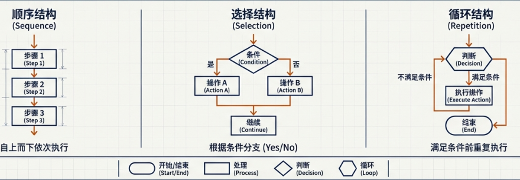

### 1.3 🚀 程序的四种高级属性

在实际应用中，程序还具备一些高级特性，以适应更复杂的运行环境：

* **可重定位 (リロケータブル / Relocatable)**：程序可以在主存储器（内存）的任何位置加载并正确执行，而不需要固定在某个特定的地址。
* **可重用 (リユーザブル / Reusable)**：程序在执行一次后，无需从硬盘重新加载到内存，就可以被再次调用和执行。
* **可重入 (リエントラント / Reentrant)**：程序可以被多个任务同时调用，并且每个任务都能得到正确的结果，互不干扰。这在多任务处理中至关重要。
* **递归 (リカーシブ / Recursive)**：程序在执行过程中，可以直接或间接地调用自身。

---

## 2. 🧰 程序员的工具箱：数据结构 with 基础算法

数据结构是组织和存储数据的方式，而算法则是操作这些数据的方法。选择合适的数据结构和算法，是编写高效程序的关键。

### 2.1 📦 数据的组织方式：核心数据结构

以下是几种基础的数据存储方式：

* **数组（配列）**
  * 📦 **核心思想**：像一排编号连续的储物柜。我们可以通过编号（**索引（インデックス）**）快速访问任何一个储物柜。
  
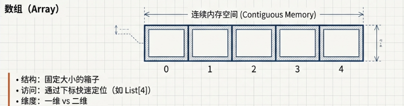

* **列表（リスト）**
  * 🔗 **核心思想**：像一串珍珠（数珠つなぎ），每个数据都通过一个**指针（ポインタ）**指向下一个数据的位置，它们在内存中不必是连续的。
  
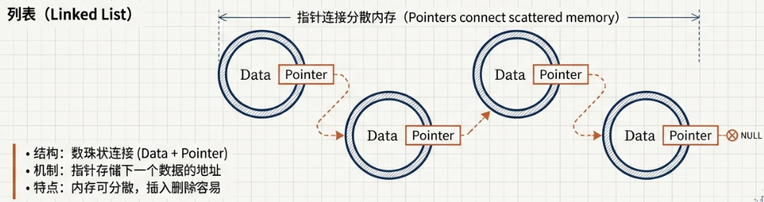

* **队列（キュー）**
  * ➡️ **核心思想**：**先进先出（First-In, First-Out, FIFO）**。可以想象成一个横向的长管子，就如同“キュー”这个词里的横线一样，最先进去的数据会最先被取出来。
  
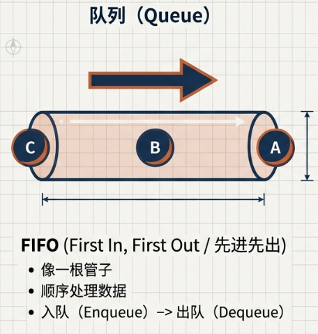

* **栈（スタック）**
  * 🥞 **核心思想**：**后进先出（Last-In, First-Out, LIFO）**。“スタック”在日语中有“堆叠”的意思，因此可以把它想象成一个垂直的容器，数据像盘子一样层层堆叠，最后放进去的盘子最先被拿出来。
  
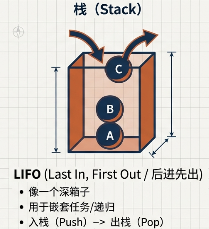

* **树形结构（木構造）**
  * 🌳 **核心思想**：用层级关系（如家谱中的亲子关系）来组织数据。它包含几个基本单位：
    * **根（ルート）**：树的最顶层节点。
    * **节点（ノード）**：树中的每个数据单元。
    * **叶（リーフ）**：没有子节点的末端节点。
  
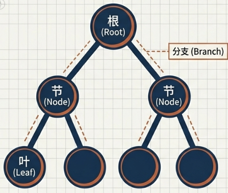

### 2.2 🔍 如何找到目标：三大搜索算法

从大量数据中找到我们需要的那一个，就需要搜索算法。

| 算法名称 | 核心思想 | 计算复杂度 |
| :--- | :--- | :---: |
| **线性搜索 (線形探索法)** | 从头到尾，逐一检查，直到找到目标。 | $O(n)$ |
| **二分搜索 (二分探索法)** | **数据必须预先排序**（升序/降序）。每次从中间切分，判断目标在哪一半，从而将搜索范围缩小一半。 | $O(\log n)$ |
| **哈希搜索 (ハッシュ探索法)** | 通过一个特殊的计算公式（**哈希函数（ハッシュ関数）**）直接计算出数据存储的位置，实现“一击即中”。 | $O(1)$ |

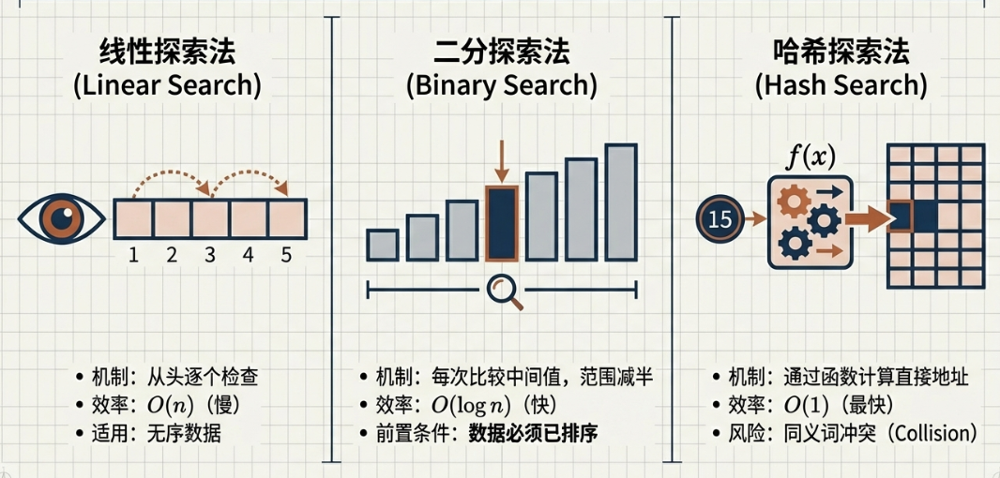

### 2.3 🔢 如何排好队伍：主要排序算法

排序是将一组无序数据整理成特定顺序（如升序或降序）的过程。

* **基本交换法 / 冒泡排序（基本交換法）**：
  * 不断比较相邻的两个元素，如果顺序不对就交换，像水中的气泡一样，较小（或较大）的元素会慢慢“浮”到顶端。
* **基本选择法（基本選択法）**：
  * 每次从待排序的数据中选出最小（或最大）的一个元素，存放在序列的起始位置，直到全部待排序的数据排完。
* **基本插入法 (基本挿入法 / Insertion Sort)**：
  * 类似于整理扑克牌。从第二个元素开始，将其与前面的元素逐一比较，插到已排序序列的正确位置，使其保持有序。

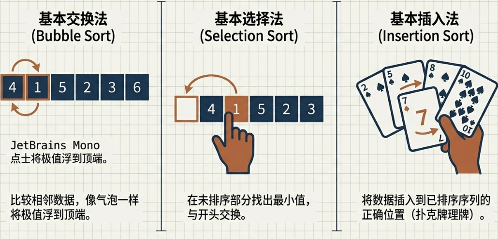

> [!NOTE]
> **时间复杂度**：以上基础排序算法（冒泡、选择、插入）在最坏情况下的时间复杂度均为 **$O(n^2)$**。

### 2.4 🏎️ 追求效率：高级排序算法

当待排序的数据量较大时，基础算法的效率往往力不从心。我们需要利用分治思想或特殊数据结构来加速：

* **希尔排序 (シェルソート / Shell Sort)**：
  * 📈 **插入排序的进化版**。先将数据按一定间隔（增量）分组进行插入排序，随着间隔逐渐缩小，最后进行一次完整的插入排序。
* **快速排序 (クイックソート / Quick Sort)**：
  * ⚡ **分治法典型**。选择一个“基准值”（Pivot），将数据分为“比基准小”和“比基准大”两组，递归处理，是目前应用最广泛的高速排序。
* **堆排序 (ヒープソート / Heap Sort)**：
  * 🏗️ **利用堆结构**。将数据构建成最大堆或最小堆，每次取出堆顶元素（最值）并重新调整堆，直到所有元素排好。
* **归并排序 (マージソート / Merge Sort)**：
  * 🧩 **拆分与合并**。将序列不断对半拆分为更小的子序列，直到每个子序列只有一个元素，再将有序的子序列通过“归并”操作合并成完整的有序序列。

> [!NOTE]
> **时间复杂度**：这些高级排序算法（希尔、快速、堆、归并）的平均时间复杂度通常能达到 **$O(n \log n)$**。

## 3. 🗣️ 与计算机对话：编程语言及其执行过程

我们使用编程语言与计算机沟通，但这个过程需要“翻译”。

### 3.1 📜 编程语言 vs. 标记语言

* **编程语言（プログラミング言語）**：用于命令计算机执行特定处理的语言，例如 Python、Java。它的核心是 **“行动”**。
* **标记语言（マークアップ言語）**：用于定义文档结构和含义的语言，例如 HTML、Markdown。它通过标签（tag）来告诉浏览器“这是一个标题”或“这是一个段落”，核心是 **“描述”**。

### 3.2 🗣️ 翻译官的角色：解释器与编译器

计算机只能理解由0和1组成的**机器语言（機械語）**。因此，我们用高级语言编写的**源程序（原始プログラム）**必须被翻译。这个翻译工作由两种“翻译官”来完成：

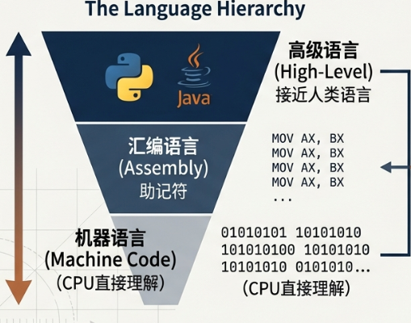

| 翻译方式 | 核心特点 | 优缺点 |
| :--- | :--- | :--- |
| **解释器 (インタプリタ)** | 逐行翻译，同步执行。 像一位同声传译，说一句翻一句。 | ✅ **优点**：易于调试，能立刻发现错误。 ⚠️ **缺点**：整体执行速度较慢。 |
| **编译器 (コンパイラ)** | 通篇翻译，一次性生成。 像一位笔译，把整本书翻译完再出版（生成目标程序）。 | ✅ **优点**：执行速度快。 ⚠️ **缺点**：调试相对困难，必须等待整个编译过程结束才能集中发现错误，难以定位错误位置。 |

> [!TIP]
> **划重点**：编译器和解释器是两种**不同的实现方案**。通常情况下，一种编程语言会根据其设计目标（追求速度还是追求灵活），在两者中选择其一。

### 3.3 🏭 一个程序的诞生之旅

一个用编译型语言（如C语言）编写的程序，从代码到最终执行，通常会经历以下三个步骤：

1. **编译（コンパイル）**
    * 🛠️ **执行者**：**编译器（コンパイラ）**
    * **任务**：将人类编写的源程序，翻译成计算机能部分理解的**目标程序（目的プログラム）**。

2. **链接（リンク）**
    * 🔗 **执行者**：**链接器（リンカ）**
    * **任务**：将一个或多个目标程序，以及程序中用到的**库文件（ライブラリ）**等外部模块，捆绑成一个完整的、可执行的**加载模块（ロードモジュール）**。

3. **加载（ロード）**
    * 📥 **执行者**：**加载器（ローダ）**
    * **任务**：将这个加载模块装入**主存储器（主記憶装置）**（即内存）中，为最终的执行做好准备。

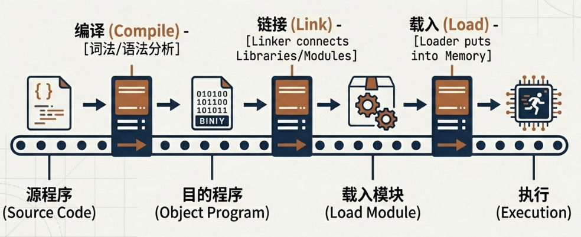

---

## 4. 🧠 编程的哲学：面向对象思想

面向对象是一种更符合人类思维习惯的编程范式，它让复杂的软件开发变得更高效、更易于管理。

### 4.1 什么是面向对象？

**面向对象（オブジェクト指向）** 的核心思想是：将真实世界或虚拟世界看作是由各种 **“对象”（オブジェクト）** 组成的。编程不再是编写一系列指令，而是定义这些对象以及它们之间的互动关系。

在面向对象中，有三个核心概念：

* **类（クラス）**：对象的 **“设计图”（設計図）**。它定义了一类对象共同拥有的属性和行为。
  * *例如，“角色类”定义了所有角色都应该有“HP”和“攻击力”这些属性，以及“攻击”和“防御”这些行为。*
* **实例（インスタンス）**：根据“设计图”（类）创建出来的具体对象。
  * *例如，根据“角色类”这个设计图，可以创建出“勇者A”和“怪物B”这两个具体的实例。*
* **属性（プロパティ）与方法（メソッド）**：
  * **属性**是对象的数据（状态），如角色的HP、名字。
  * **方法**是对象的行为（动作），如角色的攻击、防御动作。

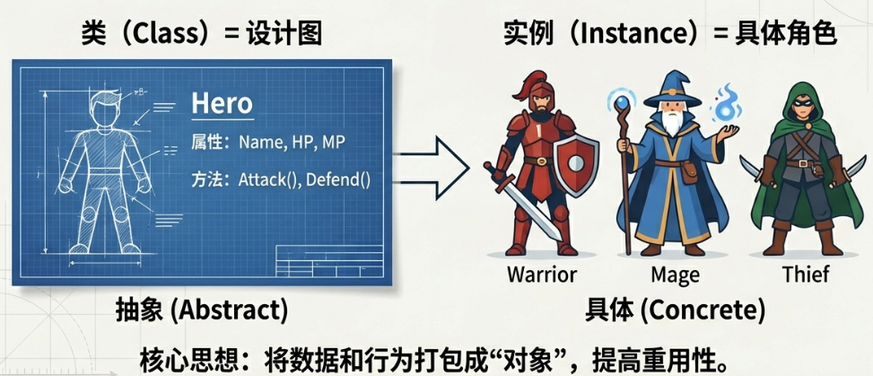

### 4.2 🏛️ 面向对象的三大支柱

面向对象的强大之处体现在它的三大特征上，它们共同保证了代码的可重用性、安全性和灵活性。

#### 1. 继承（継承）

* **思想**：子类可以自动继承父类的属性和方法，并可以添加自己特有的功能。
* **比喻**：我们可以先创建一个通用的“角色设计图”（父类），然后基于它派生出“主人公设计图”（子类）和“敌人设计图”（子类）。这样，子类就无需重复定义HP、攻击力等通用属性，只需添加各自独特的方法即可。

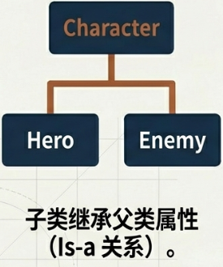

#### 2. 封装（カプセル化）

* **思想**：将对象的内部数据（属性）和实现细节隐藏起来，只对外暴露有限的接口（方法）来与之交互。
* **比喻**：这就像一台自动售货机。我们不需要知道它内部的制冷、投币和出货的复杂原理，只需通过“投币”和“按按钮”这两个接口就能使用它。封装可以保护对象内部的数据不被随意修改，从而防止意外的bug。

#### 3. 多态（ポリモーフィズム / 多様性）

* **思想**：同一个指令或调用，作用于不同的对象时，会产生不同的行为。
* **比喻**：当我们下达“攻击”这个指令时：
  * ⚔️ 主人公对象会执行“挥拳”这个行为。
  * 🔥 敌人对象可能会执行“喷火”这个行为。
* 我们将子类重新定义父类方法的行为，称为**方法重写（オーバーライド）**。正是通过这种机制，多态性得以实现，极大地增强了代码的灵活性。

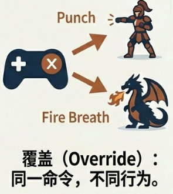

### 4.3 📐 系统设计的通用语言：UML

在进行面向对象开发时，为了让团队成员能够清晰地沟通和理解复杂的系统设计，我们使用一套标准的图形化语言——**UML（统一建模语言，統一モデリング言語）**。它就是系统开发的“图纸”。

以下是几种常见的UML图：

* **类图（クラス図）**：展示系统中有哪些类，每个类有哪些属性和方法，以及类与类之间的关系（如继承、关联）。
* **序列图（シーケンス図）**：按时间顺序，详细描绘对象之间是如何通过发送消息来进行交互的。
* **活动图（アクティビティ图）**：描述业务流程或某个处理的具体流程，外观和逻辑上非常类似我们之前提到的流程图。
* **用例图（ユースケース図）**：从用户（**执行者（アクター）**）的视角，描述系统提供了哪些功能（用例），以及哪些用户可以使用这些功能。

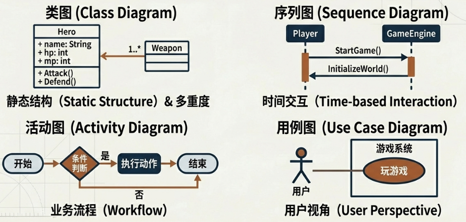

---

  <em>"于算法中寻找逻辑之美，在代码里构建秩序之光。"</em> 
  <strong>Find the beauty of logic in algorithms; build the light of order in code.</strong>

