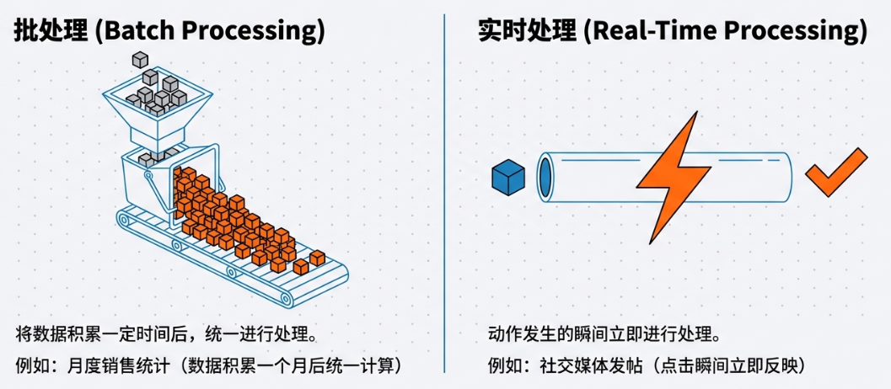
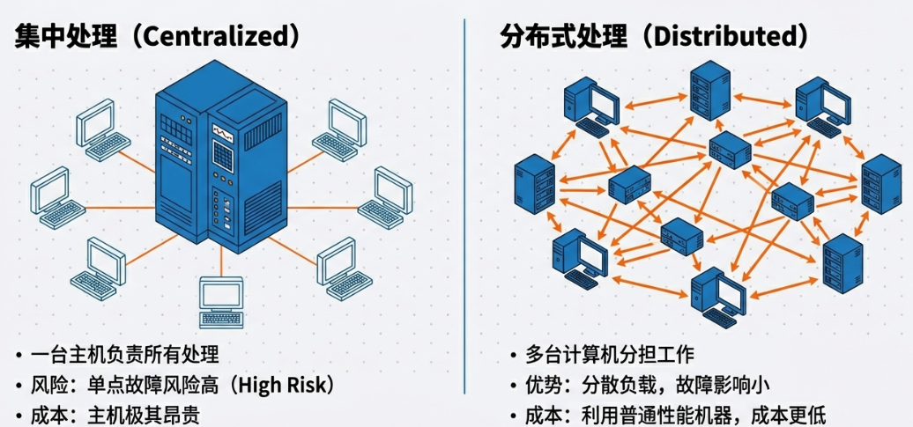
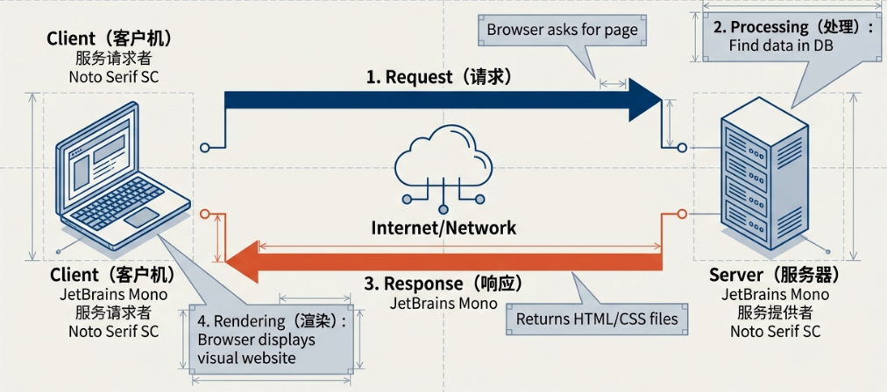
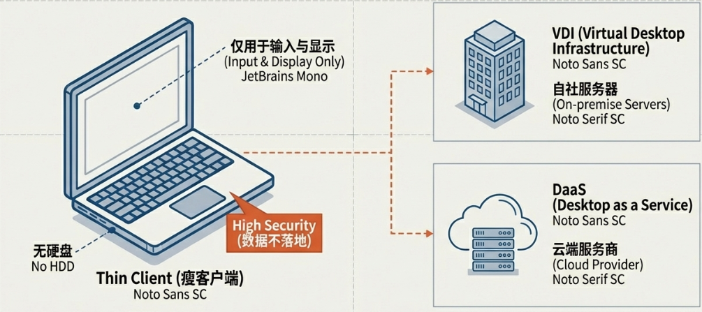
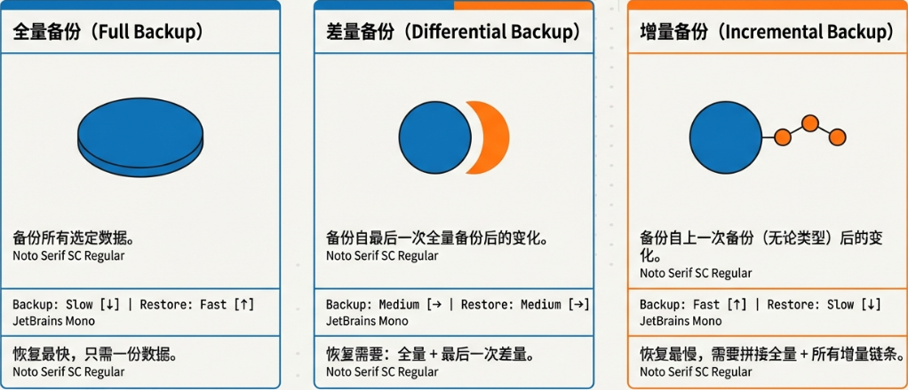
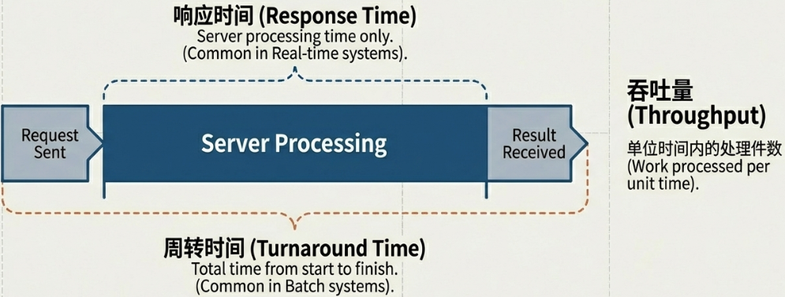
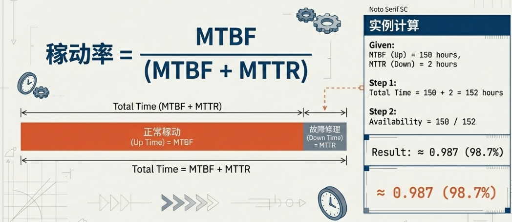
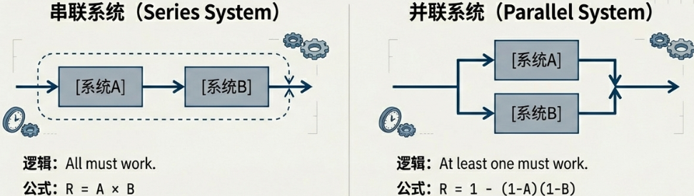

<h1 align="center">🏗️ 系统构成要素 (System Architecture)</h1>

  <strong>System Configuration & Reliability</strong> 
  <i>システム構成要素と信頼性</i>

---

## 1. 🧩 系统处理与构成 (System Processing & Structure)

### 1.1 系统的分类 (System Classification)

根据数据的处理时机，系统主要分为以下两类：

| 类别 | 定义 | 示例 |
| :--- | :--- | :--- |
| **批处理** (バッチ処理) | 将数据累积一定时间后，再统一进行处理。 | 营业额月度汇总、工资结算。 |
| **实时处理** (リアルタイム処理) | 发生动作（Action）时，**立即处理**并反映结果。 | SNS投稿、银行ATM转账。 |

### 1.2 系统的处理形态 (Processing Types)

* **集中处理 (集中処理)**：
  * 由一台计算机处理所有任务。
  * ⚠️ **风险**：单点故障 (Single Point of Failure)，且高性能机器成本高。
* **分布式处理 (分散処理)**：
  * 任务分布在多台系统上。
  * ✅ **优点**：单机负载低，局部故障不影响全局。

### 1.3 客户端-服务器系统 (Client-Server System)

* **客户端 (クライアント)**：发出服务请求的一端（如我们的PC、手机）。
* **服务器 (サーバー)**：提供服务的一端（高性能计算机）。

### 1.4 三层架构与瘦客户机 (3-Tier & Thin Client)

* **三层架构 (三層システム)**：
    1. **表现层 (プレゼンテーション層)**：看得到的界面。
    2. **应用层 (アプリケーション層)**：业务逻辑处理。
    3. **数据库层 (データベース層)**：数据管理。

* **瘦客户机 (シンクライアント)**：
  * 客户端仅保留最基本的输入输出功能，**不安装硬盘**（HDD/SSD）或应用程序。
  * 所有数据和处理都在服务器端完成，极大提高了 **安全性 (セキュリティ)**。
  * **VDI (仮想デスクトップ基盤)**：在公司服务器上构建虚拟桌面。
  * **DaaS (Desktop as a Service)**：利用云端提供的虚拟桌面服务。

---

## 2. 🛡️ 系统的冗余化与备份 (Redundancy & Backup)

### 2.1 系统冗余化 (System Redundancy)

为了防止系统停机，预先准备备份系统的设计。

* **双机并行系统 (Dual System / デュアルシステム)**：
  * 两组系统 **同时进行相同处理** 并 **比对结果**。
  * 💎 **特点**：可靠性极高，但成本也高。
* **双工系统 (Duplex System / デュプレックスシステム)**：
  * 分为 **主用机** 和 **备用机**。
  * **热备用 (Hot Standby / ホットスタンバイ)**：备用机处于 **启动状态**，故障时 **秒级切换**。
  * **冷备用 (Cold Standby / コールドスタンバイ)**：备用机平时 **关机**，故障时需重启加载，切换慢。

### 2.2 数据备份 (Data Backup)

| 方式 | 备份内容 | 备份速度 | 还原速度 |
| :--- | :--- | :--- | :--- |
| **完全备份** (Full Backup) | 全部数据 | 🐢 最慢 | 🐇 最快 (只需最后一次备份) |
| **差异备份** (Differential Backup) | 自上次“**完全备份**”以来变更的数据 | ⚖️ 中 | ⚖️ 中 (需首次全备+最后一次差异) |
| **增量备份** (Incremental Backup) | 自上次“**任何备份**”以来变更的数据 | 🐇 最快 | 🐢 最慢 (需全备+期间所有增量) |

### 2.3 浴缸曲线 (Bathtub Curve / バスタブ曲線)

描述硬件故障率随时间变化的曲线：

1. 📉 **早期故障期 (Initial Failure Period / 初期故障期)**：设计或制造缺陷导致故障率初期较高，随时间下降。
2. ➡️ **偶发故障期 (Random Failure Period / 偶発故障期)**：故障率 **低且稳定**。
3. 📈 **耗损故障期 (Wear-out Failure Period / 摩耗故障期)**：零件老化导致故障率再次上升。

---

## 3. 📊 系统的性能与可靠性评估 (Performance & Reliability)

### 3.1 性能指标 (Performance Metrics)

* **吞吐量 (Throughput / スループット)**：单位时间内处理的工作量。
* **周转时间 (Turnaround Time / ターンアラウンドタイム)**：从输入数据到输出结果完成的总时间（常用于 **批处理**）。
* **响应时间 (Response Time / レスポンスタイム)**：服务器处理请求并返回的时间（不含用户端操作，常用于 **实时处理**）。
* **基准测试 (Benchmark / ベンチマークテスト)**：使用专用程序运行系统，评估其相对性能。

### 3.2 RASIS 评估指标

1. **Reliability (可靠性/信頼性)**：故障发生的频率，坏的少吗？指标：`MTBF`。
2. **Availability (可用性/可用性)**：系统随时可用的程度，随时能用吗？指标：`稼働率`。
3. **Serviceability (维修性/保守性)**：故障后修复的快慢，坏了修的快吗？指标：`MTTR`。
4. **Integrity (完整性/保全性)**：数据不缺失、不损坏，数据精准吗？
5. **Security (安全性/安全性)**：防御非法访问的能力，数据安全吗？

### 3.3 可靠性计算公式 (Calculations)

> [!IMPORTANT]
> **考试必考公式**

* **MTBF (Mean Time Between Failures / 平均故障間隔)**：
    $$ \text{MTBF} = \frac{\text{系统正常工作的总时间}}{\text{故障次数}} $$
* **MTTR (Mean Time To Repair / 平均修理時間)**：
    $$ \text{MTTR} = \frac{\text{修理总时间}}{\text{故障次数}} $$
* **可用率 (Availability / 稼働率)**：
    $$ A = \frac{\text{MTBF}}{\text{MTBF} + \text{MTTR}} $$

### 3.4 串并联系统的稼働率

* **直连 (Series System / 直列システム)**：所有设备都必须正常工作。
    $$ A_{\text{total}} = A \times B $$
* **并联 (Parallel System / 並列システム)**：只要有一台正常工作即可。
    $$ A_{\text{total}} = 1 - (1 - A) \times (1 - B) $$

---

## 4. 💡 可靠性设计 (Reliability Design Logic)

### 4.1 容错 (Fault Tolerance / フォルトトレランス)

> **“我有备胎，我怕谁？”**

* **核心逻辑**：承认“系统一定会坏”，所以通过 **冗余（多准备一份）** 来抵御故障。
* 📝 **例子**：就像一架拥有两台发动机的客机。如果飞着飞着，左边的发动机突然“罢工”了，没关系，右边的发动机可以独立撑起整架飞机的动力。

### 4.2 故障安全 (Fail Safe / フェールセーフ)
>
> **“安全第一，宁可停摆。”**

* **核心逻辑**：故障发生时，系统会自动转向 **“安全侧”**，哪怕牺牲功能也要保护人命或核心财产。
* 📝 **例子**：交通信号灯控制系统坏了，它绝对不会让四个方向都变成绿灯，而是会触发故障安全机制，让所有方向都变红灯，或者让黄灯闪烁。

### 4.3 故障弱化 (Fail Soft / フェールソフト)
>
> **“虽然受伤，但还能苟住。”**

* **核心逻辑**：故障发生时，**舍弃次要功能**，保证最核心的部分能维持基本运作。
* 📝 **例子**：智能空调变频功能坏了，但依然能维持最基础的“制冷/制热”。通过性能降级来换取持续服务。

### 4.4 防呆 (Foolproof / フールプルーフ)
>
> **“我是为了保护你的疏忽。”**

* **核心逻辑**：预测人可能会犯低级错误，从而在设计上杜绝误操作的可能性。
* 📝 **例子**：微波炉如果不关紧门，绝对不会开始加热。相机的SD卡缺了一个角，插反了根本插不进去。

---

## 📚 术语表 (Glossary)

| 中文词汇 | 假名标注 | 英文参考 |
| :--- | :--- | :--- |
| **批处理** | バッチ処理 | Batch Processing |
| **实时处理** | リアルタイム処理 | Real-time Processing |
| **集中处理** | 集中処理 | Centralized Processing |
| **分散处理** | 分散処理 | Distributed Processing |
| **冗余化** | 冗余化（じょうじょうか） | Redundancy |
| **表现层** | プレゼンテーション層 | Presentation Layer |
| **瘦客户机** | シンクライアント | Thin Client |
| **虚拟桌面** | 仮想デスクトップ | VDI |
| **可利用率** | 稼働率（かどうりつ） | Availability |
| **平均故障间隔** | 平均故障間隔 | MTBF |
| **平均修理时间** | 平均修理時間 | MTTR |
| **容错** | フォルトトレランス | Fault Tolerance |
| **故障安全** | フェールセーフ | Fail Safe |
| **故障弱化** | フェールソフト | Fail Soft |
| **防呆** | フールプルーフ | Foolproof |

---

  <em>"系统之稳固源于冗余的智慧，信任之基石在于持久的恒常。"</em> 
  <strong>Robustness is born from the wisdom of redundancy; trust is built on the foundation of consistency.</strong>

