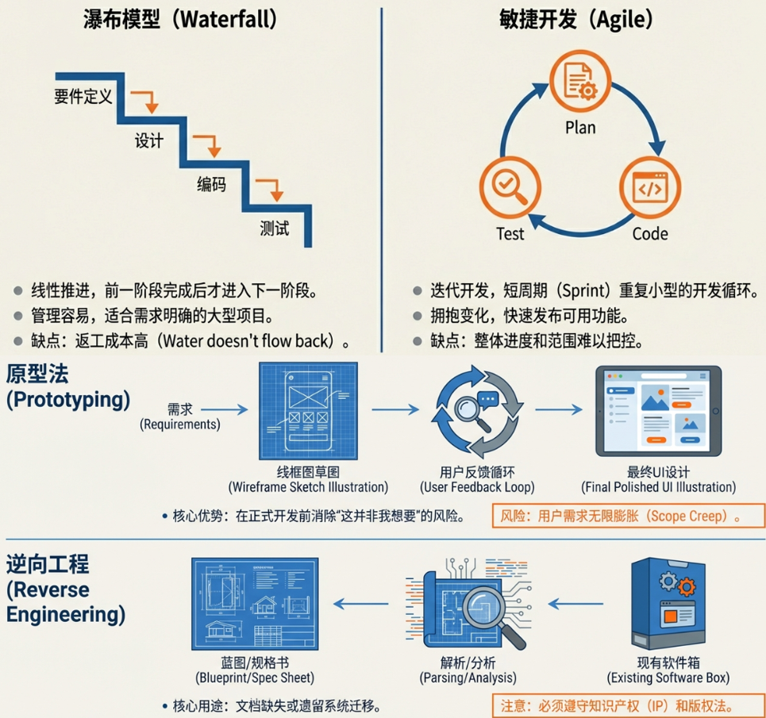
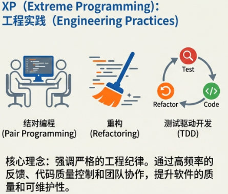
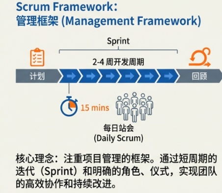
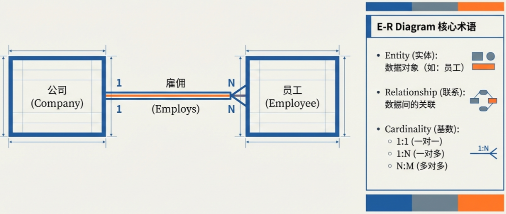
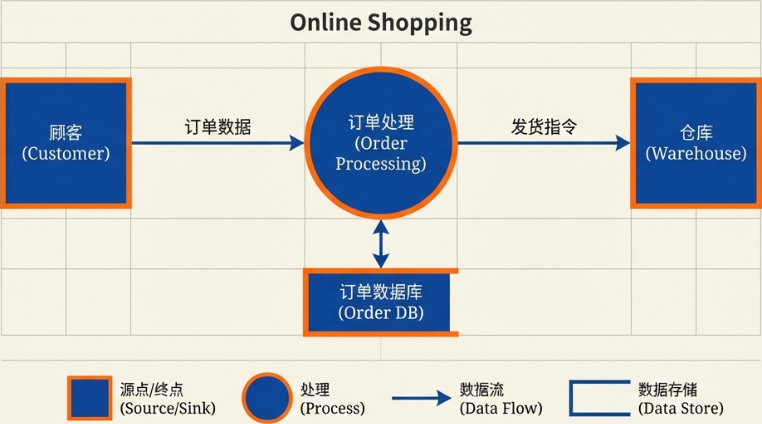
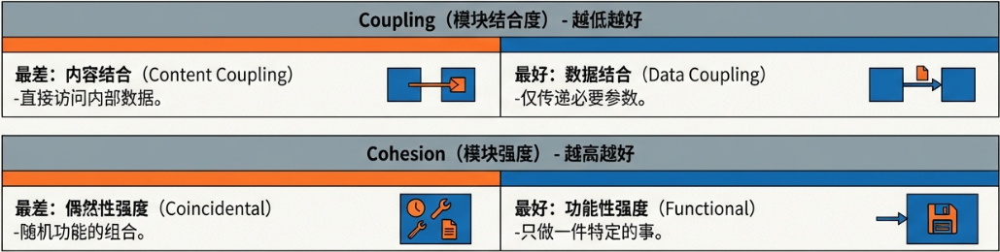
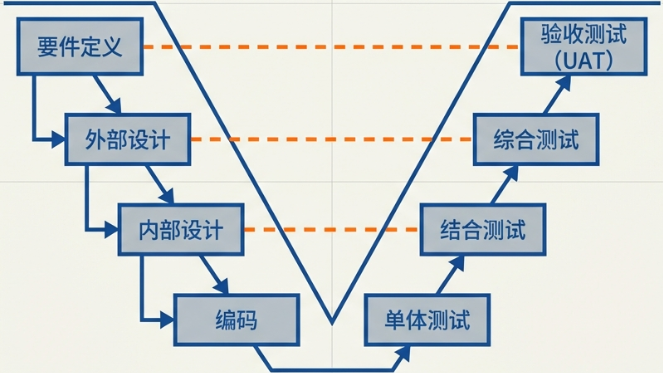
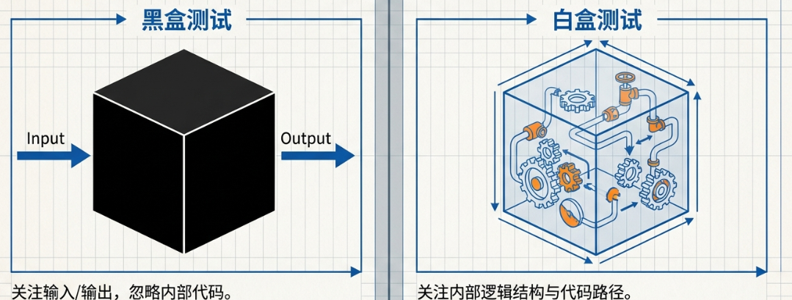
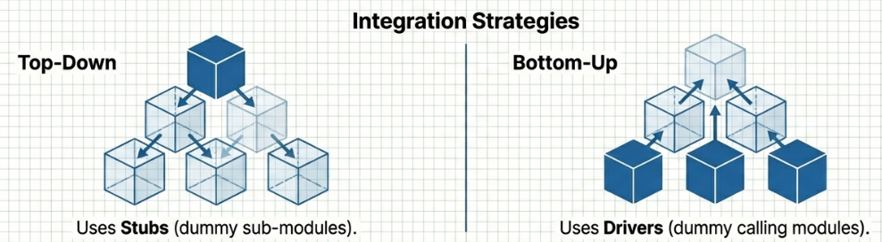
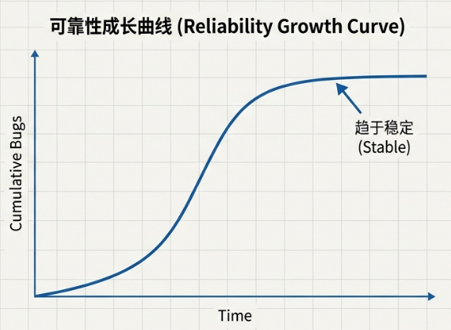

<h1 align="center">🚀 软件开发管理 (Software Development Management)</h1>

  <strong>Development Methodologies & Processes</strong> 
  <i>ソフトウェア開発管理と工程</i>

---

## 1. 🌊 系统开发流程全景图 (System Development Flow)

在IT工程中，为了避免用户企业（User Enterprise）与开发商（Vendor）之间产生误解，业界定义了 **共通框架 (Common Frame / 共通フレーム)**。它就像一把“共同标尺”，通过标准化语言确保双方在开发内容与责任范围上达成共识。

### 1.1 开发阶段对照表

| 阶段 | 术语对照（汉字/假名） | 核心任务 | 责任主导 |
| :--- | :--- | :--- | :---: |
| **规划** | **企画** (きかく) | 基于经营战略制定系统构想。 | **用户企业** |
| **需求定义** | **要件定義** (ようけんていぎ) | 确定系统“必须做什么”。 (功能/非功能需求) | **双方协作** |
| **开发** | **開発** (かいはつ) | 包含设计、编码、测试等所有将想法落地的过程。 | **开发商** |
| **运行** | **運用** (うんよう) | 系统上线后的日常监控、利用支援。 | **用户企业** |
| **维护** | **保守** (ほしゅう) | 应对Bug修复、环境变化或系统升级的修改。 | **开发商** |

> [!NOTE]
> **需求分类**
>
> * **功能需求 (Functional Requirement / 機能要件)**：明确系统必须具备的功能（如：人事系统需包含进度管理功能）。
> * **非功能需求 (Non-Functional Requirement / 非機能要件)**：与品质相关的指标（如：安全性、响应速度、故障恢复时间）。

---

## 2. 🤝 供应商选定与评审机制 (Vendor Selection & Review)

### 2.1 选拔“两步走”

用户企业通过以下步骤来选拔最佳供应商：

1. **RFI (Request For Information / 情報提供依頼書)**：
    * **信息请求**。用于了解供应商的技术实力，进行一次审查（初步筛选）。
2. **RFP (Request For Proposal / 提案依頼書)**：
    * **提案请求**。用户企业提供具体需求，供应商给出针对性的设计方案与报价，用于最终选拔。

### 2.2 评审 (Review / レビュー)

在设计阶段，为了 **早期发现错误**（Early Detection），必须进行评审：

* **走查 (Walkthrough / ウォークスルー)**：
  * 由 **开发者本人** 主持，向同事解释代码或设计，侧重交流。
* **审查 (Inspection / インスペクション)**：
  * **最严谨** 的方法。
  * 事先分配角色（如：主持人 `Moderator`、记录员 `Scribe`、陈述人 `Presenter`）。
  * 依据 **检查清单 (Checklist)** 严格评审。
* **轮转评审 (Round Robin / ラウンドロビン)**：
  * 全员 **轮流担任** 主持人，确保所有人都能参与并提出意见。

---

## 3. 🛠️ 四大主流开发模式深度对比 (Development Models)

---

## 4. 🏃 敏捷开发分支：XP 与 Scrum (XP & Scrum)

### 4.1 XP (Extreme Programming / エクストリームプログラミング)

侧重 **工程实践**，其三大核心实践是备考重中之重：

1. **结对编程 (Pair Programming / ペアプログラミング)**：
    * 两人共用一台电脑，一人编码 (**Driver**)，一人指挥检查 (**Navigator**)。
2. **重构 (Refactoring / リファクタリング)**：
    * 在 **不改变外部功能** 的前提下，**优化代码结构**，使其简洁。
3. **测试驱动开发 (TDD / テスト駆動開発)**：
    * **“测试先行”** 逻辑。
    * 流程：`先写测试代码` -> `写出代码通过测试` -> `Refactoring`。

### 4.2 Scrum (スクラム)

侧重 **团队管理**：

* **冲刺 (Sprint / スプリント)**：2-4周的固定开发循环。
* **每日站会 (Daily Scrum / デイリースクラム)**：每天约15分钟同步进度。

---

## 5. 📐 业务建模与 UI 设计 (Modeling & UI)

### 5.1 逻辑蓝图

* **ER图 (Entity-Relationship Diagram / E-R図)**：数据库设计核心。
  * 包含：**实体** (Entity/実体) & **关联** (Relationship/リレーションシップ)。
  * **关系逻辑**：1对1、1对多。
  * *注意*：箭头方向通常表示“1”的一侧。（如：`Employee` -> `Company` 表示多名员工属于一家公司）。
  

* **DFD (Data Flow Diagram / データフロー図)**：
  * ➡️ **箭头**：数据流 (Data Flow)
  * ⭕ **圆圈**：处理过程 (Process)
  * ⬜ **矩形**：源点/终点 (Source/Sink)
  

### 5.2 UI/接口设计

* **GUI (Graphical User Interface)**：
  * **单选框 (Radio Button / ラジオボタン)**：N选1。
  * **复选框 (Check Box / チェックボックス)**：多选。
  * **下拉菜单 (Pull-down Menu / プルダウンメニュー)**。
  * **组合框 (Combo Box / コンボボックス)**：既可以从下拉列表选，也可以手动输入。
* **CUI (Character User Interface)**：文本命令行界面。

---

## 6. 🧩 模块划分与独立性评价 (Module Design)

### 6.1 模块化 (Modularization)

**模块化 (Modularization / モジュール化)** 是将庞大复杂的系统分解为若干个 **独立** 且 **功能单一** 的部件（模块）的过程。

### 6.2 模块独立性评价 (Independence Evaluation)

如何评价程序内部拆分（模块化）的好坏？

**目标：高强度、低耦合 (High Cohesion, Low Coupling)**

1. **模块耦合度 (Module Coupling / モジュール結合度)**：
    * 定义：模块间的依赖关系。**越弱（低）越好**。
    * 🏆 **最佳**：**数据结合 (Data Coupling / データ結合)** —— 仅传递必要参数。
2. **模块强度 (Module Cohesion / モジュール強度)**：
    * 定义：模块内部的功能集中度。**越强（高）越好**。
    * 🏆 **最佳**：**功能性强度 (Functional Cohesion / 機能的強度)** —— 一模块仅负责单一特定功能。

  

## 7. 🧪 V字模型与测试体系 (V-Model & Testing)

### 7.1 V字模型 (V-Model)

开发阶段与测试阶段的 **一一映射** 关系：

| 开发阶段 (Development) | 对应测试 (Testing) | 验证逻辑 |
| :--- | :--- | :--- |
| **需求定义** | **验收测试** (Acceptance Test /UAT) | 用户最终检查是否符合初衷。 |
| **外部设计** (基本设计) | **综合测试** (System Test / 総合テスト) | 验证整体运行及网络、周边环境。 |
| **内部设计** (详细设计) | **结合测试** (Integration Test / 結合テスト) | 验证模块间组合后是否正常。 |
| **编码** | **单体测试** (Unit Test / 単体テスト) | 针对单个功能单元。 |

  

### 7.2 测试核心技术

* **黑盒测试 (Black Box Test / ブラックボックステスト)**：不看内部逻辑，只看输入输出。
  * **等价划分**：选代表数值。
  * **边界值分析**：测试临界值（如 <, <=, >, >= 的边界）。
* **白盒测试 (White Box Test / ホワイトボックステスト)**：看内部代码结构。
  * **覆盖标准**：命令覆盖 < 分支覆盖 < 条件覆盖 < 多重条件覆盖 (最高)。

  

* **测试工具**：
  * 🔼 **驱动程序 (Driver)**：自下而上测试时，模拟“上级”调用者。
  * 🔽 **桩 (Stub)**：自上而下测试时，模拟“下级”被调模块。

  

  
* **回归测试 (Regression Test / 回帰テスト)**：确保新功能没有破坏旧功能。

### 7.3 可靠性增长曲线 (Reliability Growth Curve)

* **S字形曲线 (Gompertz Curve)**：
    1. **初期**：Bug发现慢。
    2. **中期**：Bug大量涌现，曲线陡峭。
    3. **后期**：系统趋稳，曲线平缓。

  

---

## 8. 🏛️ 企业架构 (EA - Enterprise Architecture)

EA 是从宏观视角实现企业的 **全体最优 (Overall Optimization / 全体最適)**。

1. **Business (业务架构)**：定义业务流程与策略。
2. **Data (数据架构)**：定义数据间的关联性 (E-R图等)。
3. **Application (应用架构)**：定义软件系统功能。
4. **Technology (技术架构)**：定义服务器、网络等硬件基础设施。

---

## 📚 备考核心词汇表 (Glossary)

| 中文词汇 | 假名标注 | 英文参考 |
| :--- | :--- | :--- |
| **共通框架** | 共通（きょうつう）フレーム | Common Frame |
| **需求定义** | 要件定義（ようけんていぎ） | Requirements Definition |
| **非功能需求** | 非機能要件（ひきのうようけん） | Non-Functional Requirement |
| **瀑布模型** | ウォーターフォールモデル | Waterfall Model |
| **敏捷开发** | アジャイル | Agile |
| **重构** | リファクタリング | Refactoring |
| **黑盒测试** | ブラックボックステスト | Black Box Test |
| **白盒测试** | ホワイトボックステスト | White Box Test |
| **回归测试** | 回帰（かいき）テスト | Regression Test |
| **验收测试** | 受入（うけいれ）テスト | Acceptance Test |
| **耦合度** | 結合度（けつごうど） | Coupling |
| **内聚度** | 強度（きょうど） | Cohesion |
| **模块化** | モジュール化 | Modularization |

---

  <em>"代码编织逻辑的经纬，流程构建系统的脊梁。"</em> 
  <strong>Code weaves the fabric of logic; Process builds the backbone of the system.</strong>

