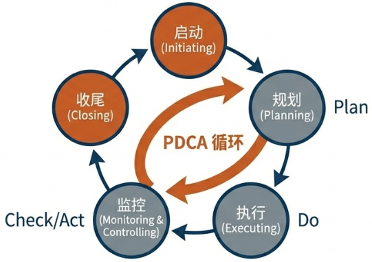
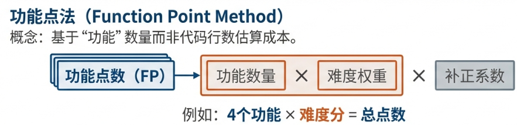
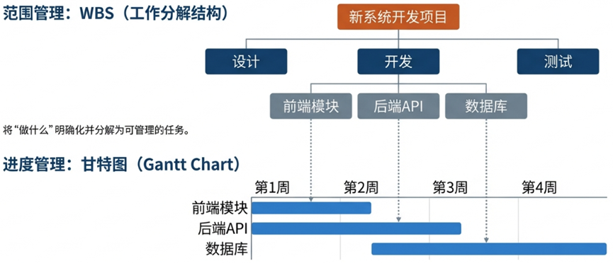
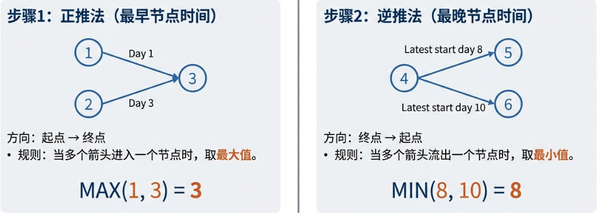
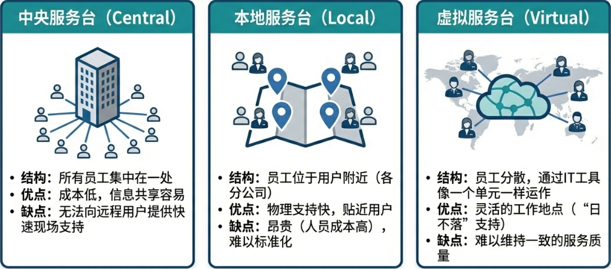
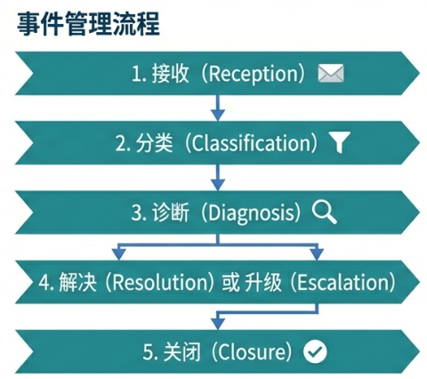
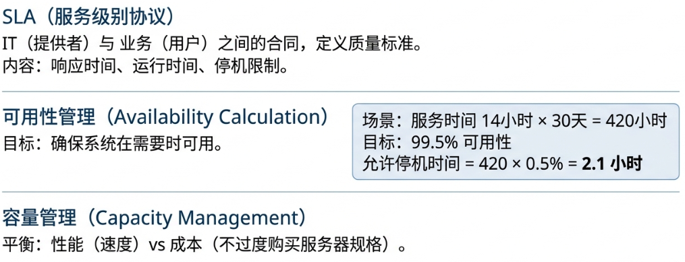
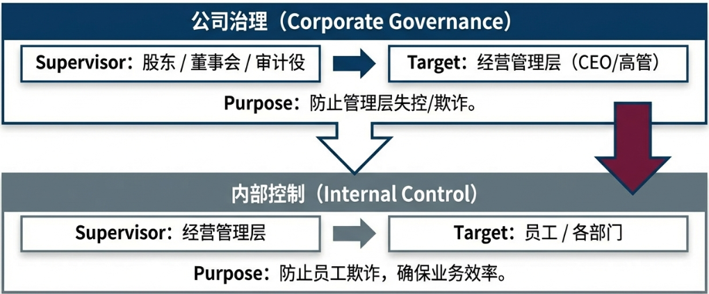

<h1 align="center">📊 项目管理与工程 (Project Management)</h1>

  <strong>Project Management & IT Service Management</strong> 
  <i>プロジェクトマネジメントとITサービス管理</i>

---

## 1. 项目管理 (Project Management)

**项目 (Project / プロジェクト)** ：在规定的 **期限** 内，为了达成 **特定目的** 而进行的活动。为了在全球范围内标准化管理流程，我们遵循 **PMBOK (Project Management Body of Knowledge / ピンボック)**。

### 1.1 项目 vs 运维 (Project vs Operations)

| 特征 | 🏗️ 项目 (Project) | ⚙️ 运维 (Operations) |
| :--- | :--- | :--- |
| **时效性** | **有时限** (Temporary)，有明确的开始与结束 | **持续性** (Ongoing)，重复进行 |
| **目的** | 创造**独特**的产品或服务 (Unique) | 维持业务的正常运转 (Sustain) |
| **对应章节** | 本文第 1~3 章 (PMBOK) | 本文第 4 章 (ITIL) |

### 1.2 启动前的关键：可行性研究 (Feasibility Study)

在项目启动前的概要调查阶段，必须进行 **FS (Feasibility Study / フィジビリティースタディ)**。其目的是从 **技术、经济** 等角度调查项目是否具备 **“执行可能性”** 以及 **“利润空间”**，从而预防在执行阶段出现大幅度的计划变更或预算超支。

### 1.3 PMBOK 的骨干架构

PMBOK将项目管理细化为 **5 大流程 (Process)** 与 **10 大知识领域 (Knowledge Area)**。

* **5 大流程**：
    1. **启动** (Initiating / 立ち上げ)
    2. **计划** (Planning / 計画)
    3. **执行** (Executing / 実行)
    4. **监控** (Monitoring & Controlling / 監視及びコントロール)
    5. **收尾** (Closing / 終結)

  

* **10 大知识领域**：
    

    | 领域 | 日语术语 | 英语 |
    | :--- | :--- | :--- |
    | 整合管理 | 統合管理 | Integration |
    | 范围管理 | スコープ管理 | Scope |
    | 进度管理 | スケジュール管理 | Schedule |
    | 成本管理 | コスト管理 | Cost |
    | 质量管理 | 品質管理 | Quality |
    | 资源管理 | 資源管理 | Resource |
    | 沟通管理 | コミュニケーション管理 | Communication |
    | 风险管理 | リスク管理 | Risk |
    | 采购管理 | 調達管理 | Procurement |
    | 相关方管理 | ステークホルダー管理 | Stakeholder |

    

---

## 2. 💰 项目成本管理 (Project Cost Management)

> 🔄 **所属流程**：**计划 (Planning)**
>
> 在项目正式动工编码之前，必须先进行规划。**成本管理**属于“计划”阶段的核心活动。无论是开发规模还是工作量，都需要通过科学的方法将其数字化，从而进行预算控制。

### 2.1 规模估算：功能点法 (Function Point Method)

如何将软件这种“无形资产”数字化？**功能点法 (Function Point / ファンクションポイント法)** 的核心在于通过业务价值来估算系统规模。这也正是 FE 考试中计算题的常客。

#### 2.1.1 核心计算逻辑：难度加权

**功能点法** 不是简单的功能计数，而是根据功能类型（如输入、输出、查询）和难易度赋予点数。

| 维度 | 单纯功能计数 | 功能点法 (FP 法) |
| :--- | :--- | :--- |
| **逻辑核心** | 一律同等对待 | 考虑 **难度加权** (Weighting / 重み付け) |
| **计算方式** | 功能数 × 固定单价 | **Σ(各功能数 × 权重系数)** |

#### 2.1.2 补正系数的应用

计算出基础 FP 后，需根据系统复杂程度应用 **复杂性补正系数 (Adjustment Factor / 補正係数)**。

> [!NOTE]
> **计算公式**
> $$ \text{最终 FP} = \text{基础 FP} \times \text{补正系数} $$
>
> **实战模拟**：
> 某系统基础点数为 **24 点**，复杂性补正系数为 **0.75**。
> $$ \text{最终 FP} = 24 \times 0.75 = 18 \text{ 点} $$

### 2.2 工量估算：人月 (Man-Month)

在估算出系统规模（如 FP）后，我们需要将其转换为具体的工作量。在 IT 项目中，基准单位是 **人月 (Man-Month / にんげつ)**。

* **定义**：1 人月是指 **“一个人一个月能完成的工作量”**。
* **计算逻辑**：
    $$ \text{总工期} = \frac{\text{总工数}}{\text{人员数量}} $$

> [!CAUTION]
> **布鲁克斯法则 (Brooks' Law)**
> 增加人手理论上能缩短工期，但现实中必须考虑 **沟通成本** 和 **管理损耗**。向进度落后的项目中增加人手，往往会导致进度更加落后。

---

## 3. 📅 项目进度管理 (Project Schedule Management)

> 🔄 **所属流程**：**计划 (Planning)**
> 同样属于“计划”阶段，项目经理必须规划什么时间做完什么事。

### 3.1 进度管理的三大图表

在项目计划阶段，项目经理通常使用以下三种工具来定义范围、规划日程并分析依赖关系。

* **WBS (Work Breakdown Structure / 作業分解構成図)**：
  * **定义**：将项目团队为实现项目目标并创造必要交付物而需要实施的全部工作范围，进行阶层化的分解。
  * **作用**：明确 **“范围 (Scope)”**。最底层的要素被称为 **工作包 (Work Package)**。
* **甘特图 (Gantt Chart / ガントチャート)**：
  * **定义**：横轴表示时间，纵轴表示作业内容，用横条的长度表示作业持续时间的图表。
  * **作用**：直观展示 **“日程 (Schedule)”** 与 **“进度”**。
  * **缺点**：难以表现作业之间的**依赖关系**。

* **箭线图 (Arrow Diagram / アローダイヤグラム)**：
  * **定义**：通过 **结合点 (Node / 結合点)** 与表示任务顺序的箭线来通过网状图展示项目进度。
  * **作用**：明确表现作业之间的 **“依赖关系”**，用于计算关键路径。

### 3.2 关键路径与结合点计算

箭线图是 FE 考试计算题的重灾区，我们需要通过 **“双格箱子法”** 来计算每个节点的时间，从而找出关键路径。

#### 3.2.1 必杀技：“双格箱子法”

在每个结合点旁画两个格子：**上格** (最早时间) 和 **下格** (最迟时间)。

1. ➡️ **顺推法 (计算最早开始时间)**：
    * 从起点 (0) 开始向终点累加。
    * **汇合取大**：当多个任务汇合时，取 **最大值**（必须等所有先行作业完成）。
2. ⬅️ **逆推法 (计算最迟完成时间)**：
    * 从终点（下格=上格）倒推回起点。
    * **分叉取小**：当任务分叉时，回推取 **最小值**（不能影响后续最后期限）。

> [!TIP]
> 连接所有 **“最早时间 == 最迟时间”**（即双格箱子数字相同）的节点，所形成的路径即为 **关键路径 (Critical Path)**。
>
> **优化策略**：若要缩短总工期，**必须缩短关键路径上的作业**。缩短非关键路径对总工期无效。

---

## 4. 🛠️ 持续运行的保障：IT 服务管理 (ITSM)

> 🔄 **所属阶段**：**运维 (Operations)** —— *非项目流程*
>
> 当项目经过 **“收尾 (Closing)”** 流程，系统被正式交付给用户后，PMBOK 的使命结束，**ITIL(Information Technology Infrastructure Library)**的使命开始。此阶段不再关注“按期完工”，而是关注 **“服务水平 (SLA)”** 和 **系统的持续稳定**。

### 4.1 谁来接电话？服务台 (Service Desk)

系统上线后，用户会遇到各种问题（如“无法登录”、“打印机没反应”）。为了防止用户直接打电话骚扰正在写代码的开发人员，我们需要设立一个**统一窗口**。

* **角色**：单一联络窗口 (SPOC / Single Point of Contact)。
* **职责**：接收所有用户的咨询、报错、请求，并按流程分发。

### 4.2 怎么处理问题？事件管理 (Incident Management)

当用户报告“系统坏了”时，这被称为一个 **“事件 (Incident / インシデント)”**。运维团队的首要目标是**尽快恢复业务**（哪怕是用临时变通的方法）。

**处理流程**：

1. **记录**：服务台记下问题。
2. **分类**：判断是打印机坏了还是网络断了。
3. **升级 (Escalation)**：
    * **职能升级**：一线服务台搞不定，转给二线技术专家。
    * **层级升级**：事态严重，汇报给领导。

### 4.3 做得好不好？服务等级协议 (SLA)

为了避免“几天修好全看心情”的情况，IT 部门需要与业务部门签订“生死状”，明确承诺服务质量标准，这就是 **SLA (Service Level Agreement)**。

---

## 5. ⚖️ 独立监督与合规：系统审计 (System Audit)

> ⚖️ **所属性质**：**全生命周期监督 (Lifecycle Governance)**
>
> 审计不属于具体的“开发”或“运维”操作，而是独立于这两者之外的**监督机制**。它贯穿于系统的整个生命周期。

**系统审计 (System Audit / システム監査)** 是由 **独立第三方** 对系统进行的“健康检查”。

### 5.1 核心原则

1. **独立性 (Independence / 独立性)**：
    * 严禁审计人审计自己所属的部门（权限分离）。
    * 包含 **外观上的独立性**（组织架构分离）与 **精神上的独立性**（不带偏见）。
2. **证据驱动 (Evidence-Based)**：
    * 审计评价必须基于客观的 **审计证据 (Audit Evidence / 監査証拠)**。

### 5.2 治理与统制

| 概念 | 侧重点 | 责任人 |
| :--- | :--- | :--- |
| **公司治理** (Corporate Governance) コーポレートガバナンス | 股东/监事 监督 经营者 | 股东/董事会 |
| **内部统制** (Internal Control) 内部統制 | 经营者 建立机制 监督 员工 | **经营者/CEO** |

---

## 📚 备考核心词汇表 (Glossary)

| 中文词汇 | 假名标注 | 英文参考 |
| :--- | :--- | :--- |
| **项目管理** | プロジェクトマネジメント | Project Management |
| **可行性研究** | フィジビリティスタディ | Feasibility Study |
| **工作分解结构** | WBS（ダブリュービーエス） | Work Breakdown Structure |
| **关键路径** | クリティカルパス | Critical Path |
| **甘特图** | ガントチャート | Gantt Chart |
| **挣值管理** | EVM / アーンドバリューマネジメント | Earned Value Management |
| **功能点法** | ファンクションポイント法 | Function Point Method |
| **人月** | 人月（にんげつ） | Man-Month |
| **服务等级协议** | SLA（エスエルエー） | Service Level Agreement |
| **系统审计** | システム監査（かんさ） | System Audit |
| **内部统制** | 内部統制（ないぶとうせい） | Internal Control |

---

  <em>"由数据掌舵项目之舟，以逻辑构建信任之锚。"</em> 
  <strong>Steer the ship of projects with data; build the anchor of trust with logic.</strong>

